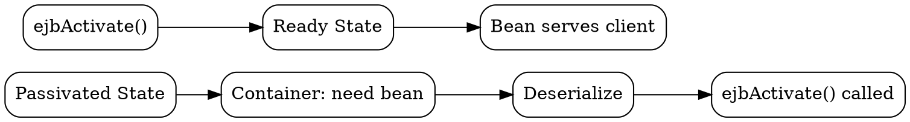

## The Problem
When a passivated stateful session bean is needed again, the container must restore its state from secondary storage back into memory. The bean needs to know when this happens to reinitialize any non-serializable resources (like database connections, JMS connections).

## Core Idea
`ejbActivate()` is a callback method that the EJB container calls on a stateful session bean AFTER it has been passivated and is now being restored to the ready state. It's the counterpart to `ejbPassivate()`.

## How It Works
1. **Container decides** — based on client request, container selects a passivated bean
2. **Deserialization** — container reads bean state from storage
3. **ejbActivate() called** — container calls this method AFTER state is restored
4. **Bean reinitializes** — open resources, reconnect to services that weren't serialized

For entity beans, `ejbActivate()` is called when an entity bean is moved from the pool to the ready state (associated with a specific primary key).

## Visual Explanation

## Key Properties
- **Callback method** — container calls it, not the client
- **Stateful SB** — reinitialize transient resources after passivation
- **Entity Bean** — called when bean moves from pool to ready (associated with PK)
- **No parameters** — container doesn't pass any arguments

## Connections
- Built from: [[passivation|Passivation]] — ejbActivate is the reverse process
- Built from: [[activation|Activation]] — the overall process this method participates in
- Contrasts with: [[ejbpassivate|ejbPassivate()]] — called before passivation
- Related: [[stateful-session-bean|Stateful Session Bean]] — primary user of this callback
- Related: [[entity-bean|Entity Bean]] — also uses this callback in lifecycle

## Edge Cases & Gotchas
- Only for stateful session beans and entity beans (NOT stateless)
- Don't do business logic here — just resource reinitialization
- If this method throws an exception, the bean may be discarded