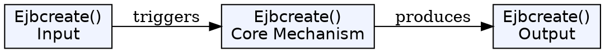
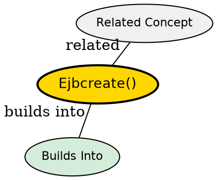

## The Problem

How does an entity bean create a new entity in the database when a client calls the home interface's create() method?

## Core Idea

`ejbCreate()` is called by the container when a client creates a new entity bean instance. The method inserts a new record into the database and returns the primary key to the container.

## How It Works

1. Client calls `home.create(accountID, ownerName)` on home interface
2. Container gets a pooled bean instance
3. Container calls `ejbCreate(accountID, ownerName)` on the bean
4. Bean executes `INSERT` query to create database record
5. Bean returns the primary key (AccountPK) to container
6. Container creates EJB Object and associates it with the bean
7. Container calls `ejbPostCreate()` after associating

## Key Properties

- Each `create` method in home interface has a corresponding `ejbCreate` in bean class
- Must return a Primary Key object to identify the new entity
- In BMP, developer writes INSERT logic in JDBC
- Container triggers after bean is associated with EJB Object
- Parameters vary based on what data the entity needs

## Visual Explanation

## Semantic Network

## Connections

- Built from: [[entity-bean|Entity Bean]], [[home-interface|Home Interface]]
- Builds into: [[ejbpostcreate|ejbPostCreate()]], [[primary-key|Primary Key]]
- Related: [[bean-managed-persistence|Bean-Managed Persistence]]

## Edge Cases & Gotchas

- Must return a primary key, not the bean itself
- Only called when creating NEW database records (not for existing)
- After `ejbCreate()` returns, the bean is no longer in pool--it has specific data