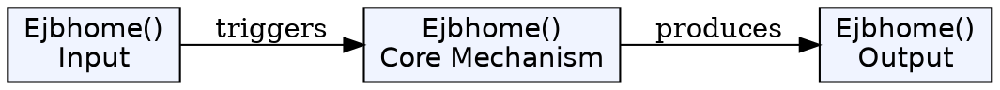
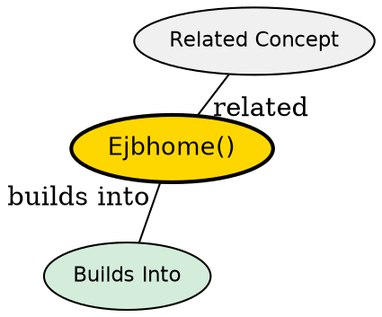

## The Problem

How do entity beans perform global operations that aren't specific to any single entity instance, such as counting total accounts or calculating aggregate values across the entire database?

## Core Idea

`ejbHome()` methods are business methods that operate on the entity bean class as a whole, not on specific entity instances. They run while the bean is still in the pool, with no specific data loaded.

## How It Works

- Client calls a home method on the home interface (e.g., `getTotalBankValue()`)
- Container delegates to the bean's `ejbHome<MethodName>()` method
- Method executes global SQL queries (e.g., `SELECT COUNT(*) FROM accounts`)
- Method returns result to client
- Bean remains in the pool--no specific data instance is associated

## Key Properties

- Called from Home Interface but implemented in the bean class
- Prefix is `ejbHome` followed by method name
- Runs while bean is in pool, not in ready state
- Can perform aggregate operations across all entities

## Visual Explanation

## Semantic Network

## Connections

- Built from: [[entity-bean|Entity Bean]], [[home-interface|Home Interface]]
- Related: [[finder-methods|Finder Methods]], [[jdbc|JDBC]]

## Edge Cases & Gotchas

- Cannot call `getPrimaryKey()` in home methods--bean has no identity
- Don't confuse with instance-specific business methods