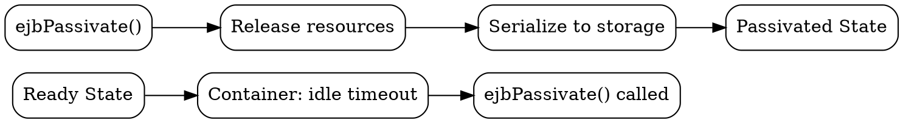

# ejbPassivate()

## The Problem
When a stateful session bean is idle (no client activity for a while), the container may want to free up memory by serializing the bean to secondary storage. Before serialization, the bean needs to release any non-serializable resources (like open database connections, network sockets).

## Core Idea
`ejbPassivate()` is a callback method that the EJB container calls on a stateful session bean BEFORE it is passivated (serialized to storage). It allows the bean to release resources that cannot be serialized.

## How It Works
1. **Container decides** — bean is idle, container chooses to passivate it
2. **ejbPassivate() called** — BEFORE serialization, container calls this method
3. **Bean releases resources** — close DB connections, JMS connections, etc.
4. **Serialization** — container serializes bean to secondary storage
5. **Memory freed** — bean instance returned to pool or garbage collected

When the client needs the bean again, `ejbActivate()` will be called to restore resources.

## Visual Explanation

## Key Properties
- **Callback method** — container calls it, not the client
- **Release non-serializable resources** — main purpose
- **Stateful SB only** — stateless beans don't have passivation
- **No parameters** — container doesn't pass any arguments

## Connections
- Built from: [[passivation|Passivation]] — ejbPassivate is part of this process
- Contrasts with: [[ejbactivate|ejbActivate()]] — called after activation (reverse)
- Related: [[stateful-session-bean|Stateful Session Bean]] — primary user of this callback
- Related: [[activation|Activation]] — the overall lifecycle process
- Related: [[instance-pooling|Instance Pooling]] — passivated beans free up pool slots

## Edge Cases & Gotchas
- Only for stateful session beans (NOT stateless, NOT entity beans)
- Don't do business logic here — just cleanup
- If this method throws an exception, passivation fails and bean stays in memory

## Sources
- [[ejb-source-summary|EJB Source Summary]]
