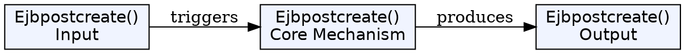
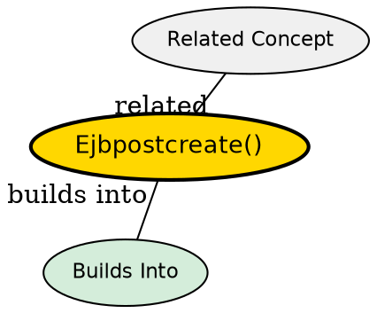

## The Problem

What happens after the bean creates a database record but before the bean is fully initialized and associated with an EJB object? How can the bean complete post-creation setup that requires knowledge of its EJB object?

## Core Idea

`ejbPostCreate()` is called by the container immediately after `ejbCreate()` once the bean is associated with an EJB object. It allows the bean to perform additional initialization using its newly created EJB object reference.

## How It Works

- Container calls `ejbPostCreate()` after `ejbCreate()` succeeds
- At this point, the EJB Object (proxy) has been created
- Bean can now call `ctx.getEJBObject()` to get its proxy
- Used to pass the proxy to other beans, reset transaction flags
- Same parameters as corresponding `ejbCreate()`

## Key Properties

- One `ejbPostCreate()` required for each `ejbCreate()` defined
- Called after bean is bound to an EJB object
- Can safely call `getEJBObject()` here (not in `ejbCreate()`)

## Visual Explanation

## Semantic Network

## Connections

- Built from: [[ejbcreate|ejbCreate()]], [[entity-bean|Entity Bean]]
- Related: [[getprimarykey|getPrimaryKey()]], [[entity-context|Entity Context]]

## Edge Cases & Gotchas

- Don't perform database operations here--`ejbCreate()` already inserted the record
- Don't assume the transaction is committed yet