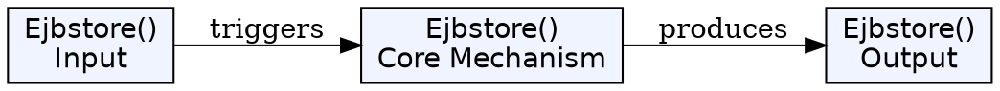
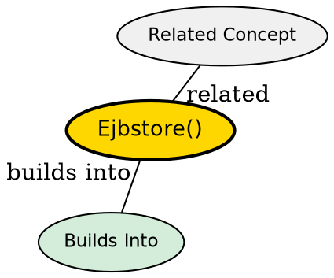

## The Problem

How does an entity bean persist its modified in-memory state back to the database? How does the container know when to flush changes?

## Core Idea

`ejbStore()` is a container callback that synchronizes the bean's in-memory field values to the database. The bean writes an UPDATE query to persist changes.

## How It Works

- Container calls `ejbStore()` typically at transaction commit or before passivation
- Bean already has the data in memory, so no need to call `getPrimaryKey()`
- Bean acquires JDBC connection
- Bean executes `UPDATE` query to persist field values
- Unlike `ejbLoad()`, bean knows its identity from in-memory fields

## Key Properties

- Called during transaction commit or before passivation
- In BMP: developer writes the UPDATE logic
- In CMP: container auto-generates the UPDATE
- No need to call `getPrimaryKey()` since data is in memory

## Visual Explanation

## Semantic Network

## Connections

- Built from: [[entity-bean|Entity Bean]]
- Builds into: [[ejbload|ejbLoad()]] (opposite operation)
- Related: [[jdbc|JDBC]], [[ejbpassivate|ejbPassivate()]]

## Edge Cases & Gotchas

- Called by container, not by client directly
- Don't confuse with `ejbPassivate()` which releases resources, not saves data