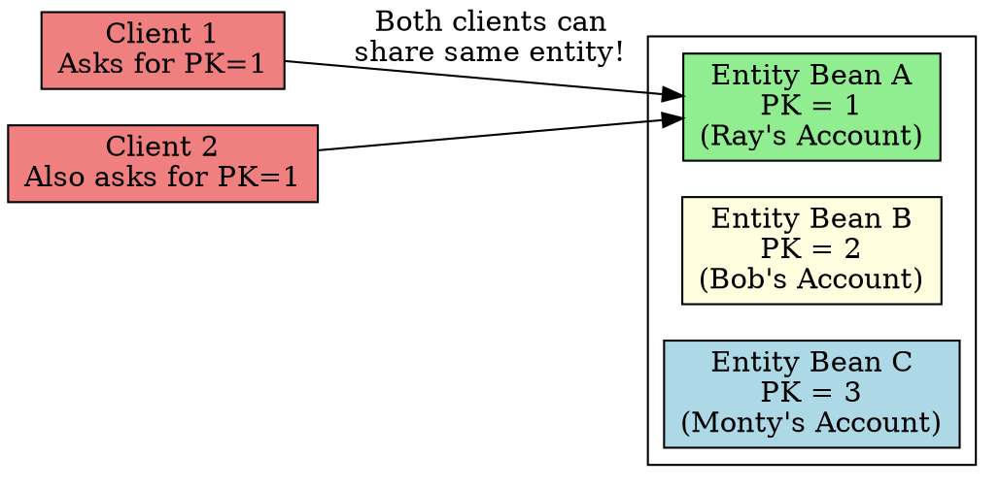

## The Problem
Session beans are all equivalent (especially stateless)—there's no way to distinguish one from another. But entity beans represent specific data records (like a specific bank account). How do you identify which entity bean instance represents which record?

## Core Idea
Entity beans have an **identity**—a primary key that uniquely distinguishes each instance. This allows:
- Comparing two entity beans ("Are they the same account?")
- Clients referring to specific entities by their primary key
- Sharing entities across multiple clients (unlike session beans which are client-dedicated)

The identity is typically the primary key of the database row the entity represents.

## How It Works
1. **Define primary key class**: `AccountPK` with fields matching the table's primary key
2. **`getPrimaryKey()` method**: Entity beans implement this to return their primary key
3. **Finder methods**: `ejbFindByPrimaryKey(PK)` locates the correct database record
4. **Client reference**: Client can pass primary keys to other clients, enabling shared access

## Visual Explanation

## Key Properties
- **Primary key = identity**: Two entity beans with same PK represent the same data
- **Shared across clients**: Unlike session beans, multiple clients can use the same entity
- **Not just for databases**: Identity concept applies even if using object databases
- **`getPrimaryKey()` in BMP**: Bean uses PK to know which record to load/store in `ejbLoad()`/`ejbStore()`

## Connections
- **Built from:** [[entity-bean|Entity Bean]], [[primary-key-class|Primary Key Class]]
- **Builds into:** [[finder-methods|Finder Methods]] (locate entities by identity)
- **Related:** [[ejbcreate|ejbCreate()]], [[ejbload|ejbLoad()]], [[ejbstore|ejbStore()]]
- **Contrasts with:** [[session-bean|Session Bean]] (no identity—anonymous workers)

## Edge Cases & Gotchas
- **Composite primary keys**: Sometimes PK has multiple fields—need a custom `PK` class
- **Identity crisis in pool**: Pooled entity beans can represent different records at different times (container swaps the data)
- **`getPrimaryKey()` not for clients**: It's for BMP beans to know which record to access