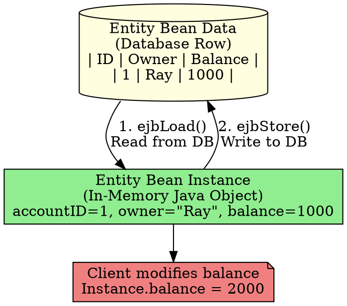

## The Problem
The term "Entity Bean" is used loosely—sometimes it means the in-memory Java object, sometimes it means the database record. This confusion makes discussions about entity beans unclear. What's the difference?

## Core Idea
The EJB spec clarifies two distinct concepts:

1. **Entity Bean Instance**: The in-memory Java object (an instance of your entity bean class). It's the "view" into the database.
2. **Entity Bean Data**: The actual persistent data stored in the database (the record/row).

The instance loads data from the database (in `ejbLoad()`), modifies it in memory, and saves it back (in `ejbStore()`).

## How It Works

```
Database Record (Entity Bean Data)
    ↓ ejbLoad()
In-Memory Object (Entity Bean Instance)
    ↓ business methods modify fields
In-Memory Object (with changes)
    ↓ ejbStore()
Database Record (updated)
```

## Visual Explanation



## Key Properties
- **Instance is temporary**: Created when needed, may be pooled/reused for different data
- **Data is permanent**: Survives server crashes, lives in database
- **One-to-one mapping**: At any moment, one instance represents one data record
- **Container manages sync**: `ejbLoad()` and `ejbStore()` keep instance and data in sync

## Connections
- **Built from:** [[entity-bean|Entity Bean]], [[ejbload|ejbLoad()]], [[ejbstore|ejbStore()]]
- **Builds into:** [[bean-managed-persistence|BMP]], [[container-managed-persistence|CMP]]
- **Related:** [[persistence-concepts|Persistence Concepts]]
- **Contrasts with:** Session beans (no persistent data, only in-memory instances)

## Edge Cases & Gotchas
- **Stale data**: If another client modifies the DB directly, in-memory instance has old data (until next `ejbLoad()`)
- **Instance pooling**: The same Java instance might represent Ray's account now, Bob's account later (container reuses instances)
- **Transparent to client**: Client doesn't know or care about instance vs data distinction—they just call methods