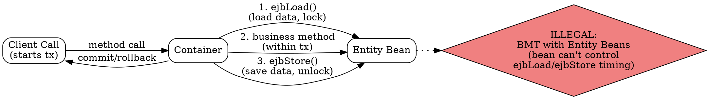

## The Problem
Both BMP and CMP entity beans have lifecycle callbacks (ejbLoad, ejbStore) that are called by the container, not the bean itself. If a developer tries to use programmatic transactions (begin/commit in code), they can't control when ejbLoad/ejbStore are called — leading to uncommitted transactions and data inconsistency.

## Core Idea
**Entity Beans (BMP and CMP) MUST use Container-Managed (Declarative) Transactions only. Programmatic (Bean-Managed) Transactions are ILLEGAL for entity beans.** This is the "Golden Rule" of EJB transactions.

## How It Works
1. When a transaction calls an entity bean, container calls `ejbLoad()` first (loads DB data, acquires locks)
2. Business methods execute within the transaction
3. On commit, container calls `ejbStore()` (writes to DB, releases locks)
4. Transaction spans: `ejbLoad()` → business methods → `ejbStore()`
5. If entity beans used BMT: developer would call `begin()` in `ejbLoad()`, but container controls when `ejbLoad()` is called — so the transaction may never properly complete
6. Entity beans load/store data **per transaction**, not per method call — the container optimizes when to actually hit the database

## Visual Explanation

## Key Properties
- **Mandatory CMT:** Entity beans (BMP and CMP) MUST use container-managed transactions
- **BMT is illegal:** Programmatic transactions cannot be used with entity beans
- Transaction spans ejbLoad → business methods → ejbStore (not per-method)
- Entity beans load/store per transaction, not per method call (performance implication)
- Session beans and MDBs CAN use BMT or CMT (entity beans cannot)

## Connections
- Built from: [[transaction-demarcation|Transaction Demarcation]] — entity beans restricted to CMT only
- Built from: [[entity-bean|Entity Bean]] — rule applies to all entity beans (BMP and CMP)
- Built from: [[ejbload|ejbLoad()]] — called by container within transaction
- Built from: [[ejbstore|ejbStore()]] — called by container within transaction
- Contrasts with: [[session-bean|Session Bean]] — session beans can use BMT or CMT
- Contrasts with: [[message-driven-bean|MDB]] — MDBs can use BMT or CMT
- Related: [[declarative-vs-programmatic-transactions|CMT vs BMT]] — why CMT is mandatory for entities

## Edge Cases & Gotchas
- Performance problem: if each method call is a separate transaction, entity bean does DB read/write per get/set
- Solution: make transactions span multiple method calls (using transaction attributes)
- BMP developers often mistakenly try BMT — it's explicitly illegal in EJB spec
- Entity beans don't control when ejbLoad/ejbStore are called — container does

## Sources
- [[EJb4-summary|EJb4.md Source Summary]]
