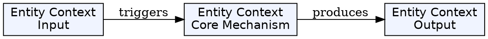
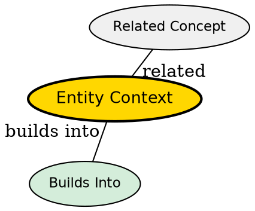

## The Problem

How does an entity bean communicate with the EJB container to access information about its environment, identity, and the transaction it is participating in?

## Core Idea

Entity Context is an interface that provides the entity bean instance with access to container services and information about the current entity it represents, including the primary key that identifies the database record.

## How It Works

- Container sets the EntityContext on the bean via `setEntityContext()`
- Bean can query the context for security info, transaction status
- Critical method: `getPrimaryKey()` returns the primary key of the current entity
- Required for BMP beans to know which database record they represent
- Context is set when bean is associated with an EJB object

## Key Properties

- Interface: `javax.ejb.EntityContext`
- Provides `getEJBObject()` and `getEJBLocalObject()` for getting the bean's proxy
- Provides `getPrimaryKey()` to identify which data instance the bean represents
- Bean instance is pooled and may represent different data at different times

## Visual Explanation

## Semantic Network

## Connections

- Built from: [[entity-bean|Entity Bean]], [[ejb-container|EJB Container]]
- Builds into: [[getprimarykey|getPrimaryKey()]], [[ejbload|ejbLoad()]], [[ejbremove|ejbRemove()]]
- Related: [[session-bean|Session Context]] for session beans

## Edge Cases & Gotchas

- Pooled instances don't have a context until associated with an EJB object
- Calling `getPrimaryKey()` before `setEntityContext()` will fail
- Context is null when bean is in the pool