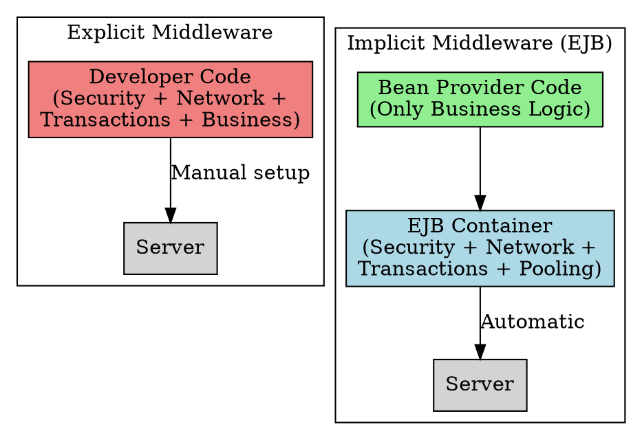

## The Problem
Distributed applications need middleware services: security, transactions, threading, network communication. Who should write this code--the application developer or the infrastructure?

## Core Idea
- **Explicit Middleware**: Developer manually writes code for networking, security, threading. You control everything but spend 80% of your time on infrastructure.
- **Implicit Middleware**: The EJB container automatically handles middleware services. Developer writes only business logic; the server manages security, transactions, and networking behind the scenes.

## How It Works

| Aspect           | Explicit Middleware                   | Implicit Middleware (EJB)                   |
| ---------------- | ------------------------------------- | ------------------------------------------- |
| **Networking**   | Developer writes socket/RMI code      | Container generates stubs/skeletons         |
| **Security**     | Developer checks permissions in code  | Container intercepts and checks roles       |
| **Transactions** | Developer begins/commits transactions | Container manages via deployment descriptor |
| **Threading**    | Developer manages thread pools        | Container manages bean pooling              |

## Visual Explanation



## Key Properties
- **Implicit middleware = Productivity**: Developer focuses on business value, not infrastructure
- **EJB Container is the implicit middleware provider**: It intercepts calls and adds services
- **Declarative approach**: In EJB, you declare requirements in `ejb-jar.xml`--container implements them
- **Vendor-specific**: Each container provider (JBoss, WebLogic) implements the implicit middleware differently


## Semantic Network

```dot
graph semantic__Explicit_vs_Implicit_Middleware_ {
  layout=neato
  node [shape=ellipse fontname="Helvetica" fontsize=11 style=filled]
  THIS [label=""Explicit Vs Implici" fillcolor="#ffd700" fontsize=13 style="filled,bold"]
  REL1 [label="Related Concept" fillcolor="#f0f0f0"]
  REL2 [label="Builds Into" fillcolor="#d4edda"]
  THIS -- REL1 [label="related"]
  THIS -- REL2 [label="builds into"]
}
```
## Connections
- **Built from:** [[middleware|Middleware]], [[ejb-container|EJB Container]]
- **Builds into:** [[transactions|Transactions]], [[jndi|JNDI]] (both provided implicitly)
- **Contrasts with:** [[rmi-remote-method-invocation|RMI]] (explicit--you write all networking code)
- **Related:** [[declarative-vs-programmatic-transactions|CMT vs BMT]]

## Edge Cases & Gotchas
- **Debugging is harder with implicit middleware**: When something fails, is it your code or the container?
- **Less control**: You can't fine-tune threading or connection pools--container decides
- **Vendor lock-in**: Implicit middleware behavior varies across vendors (though standard APIs stay same)