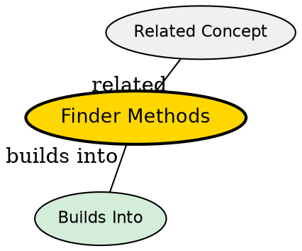

## The Problem

How do clients locate existing entity beans representing database records? Unlike session beans, entity beans persist beyond a single client interaction, so they need methods to find and load existing data.

## Core Idea

Finder methods are special methods on entity beans that search the database and return one or more primary keys of matching entity records. They don't create new data--they locate existing records.

## How It Works

- Defined on Home Interface (e.g., `findByPrimaryKey(String id)`)
- Implemented in bean class with `ejb` prefix: `ejbFindByPrimaryKey(AccountPK key)`
- Bean executes SQL SELECT query using JDBC
- Returns primary key to container, container creates EJB Object (proxy)
- Can return single key or Collection of keys

## Key Properties

- Must begin with `ejbFind` prefix
- Must implement at minimum `ejbFindByPrimaryKey()` -- required
- Return type: Primary Key object or Collection of Primary Keys
- Container generates for CMP, developer writes for BMP

## Visual Explanation

## Semantic Network

## Connections

- Built from: [[entity-bean|Entity Bean]], [[home-interface|Home Interface]]
- Builds into: [[primary-key|Primary Key]], [[bean-managed-persistence|Bean-Managed Persistence]]
- Contrasts with: [[ejbcreate|ejbCreate()]] (creates new vs finds existing)
- Related: [[finder-exception|FinderException]]

## Edge Cases & Gotchas

- Finder methods run while bean is still in the pool--before acquiring specific data
- Don't confuse with `ejbCreate()` which inserts new records
- Can return empty Collection but typically throw FinderException if not found
- Must NOT call `getPrimaryKey()` in finders--bean has no identity yet