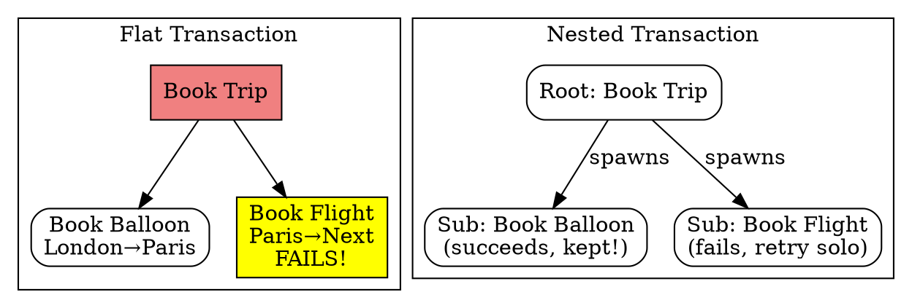

## The Problem
In a flat transaction (all-or-nothing), if one sub-operation fails, the entire transaction rolls back. For example, booking a trip: if the flight from Paris to the next city is unavailable, the entire trip booking (including valid reservations) is lost. This is too rigid for complex, multi-step business processes.

## Core Idea
A **flat transaction** is all-or-nothing — any failure rolls back the entire unit of work. A **nested transaction** has a root transaction with subtransactions; subtransactions can roll back independently without killing the parent transaction, allowing retry of just the failed part.

## How It Works

### Flat Transaction (Default in EJB)
1. All operations succeed → entire transaction commits
2. Any operation fails → entire transaction rolls back (all work lost)

### Nested Transaction
1. Root transaction spawns subtransactions (tree structure)
2. Subtransaction can roll back independently without affecting sibling or parent transactions
3. Parent transaction can retry just the failed subtransaction with different parameters
4. If nested transaction ultimately cannot commit, the entire tree fails

### Example: Trip Planning
- Root: Book round-the-world trip
  - Sub: Book London→Paris balloon ride (succeeds)
  - Sub: Book Paris→destination flight (fails — no flights)
  - **Flat:** Entire trip rolled back (balloon ride lost)
  - **Nested:** Only flight subtransaction rolls back; balloon ride kept; try different flight

## Visual Explanation

## Key Properties
- **Flat:** Simple, all-or-nothing; EJB specification default and primary model
- **Nested:** Subtransactions independent; can retry smaller units without full rollback
- EJB specification does NOT formally support nested transactions (book explicitly states this)
- Other models exist (chained transactions, sagas) but EJB also doesn't support them
- Nested transactions are a tree structure with root → subtransactions

## Connections
- Built from: [[transactions|Transactions]] — flat/nested are transaction models
- Related: [[declarative-vs-programmatic-transactions|Transaction Demarcation]] — EJB uses flat transactions with declarative demarcation
- Contrasts with: [[entity-bean-transactions|Entity Bean Transactions]] — entity beans use flat declarative transactions only
- Related: [[poison-message|Poison Message]] — rollback behavior in flat transactions causes poison messages in MDBs

## Edge Cases & Gotchas
- EJB does NOT support nested transactions despite the book describing them
- Flat transactions are the only officially supported model in EJB 2.x
- The trip-planning example helps understand why nested would be useful, but you can't use them in EJB
- Chained transactions and sagas are also unsupported in EJB

## Sources
- [[EJb4-summary|EJb4.md Source Summary]]
