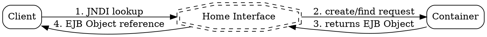

# Home Interface

## The Problem
How does a client create a new Enterprise Bean instance? Or find an existing one (especially for entity beans that represent database data)? The client needs a factory to create and locate beans without knowing the implementation details.

## Core Idea
The Home Interface is the factory interface that defines methods for creating, finding, and removing Enterprise Bean instances. It acts like a constructor that can create beans on demand.

## How It Works
1. Bean provider defines the Home Interface (in EJB 2.x style, extends EJBHome)
2. Container implements the Home Interface automatically
3. Client obtains Home Interface reference via JNDI lookup
4. Client calls create() methods on Home to get new bean instances
5. For entity beans, client calls finder methods to locate existing beans
6. Home Interface handles instantiation, but actual bean instance is wrapped by EJB Object

## Visual Explanation

## Key Properties
- Factory pattern: Creates new bean instances on demand
- Finder methods: For entity beans, locates existing persistent objects
- Lifecycle control: Also handles bean removal (remove() method)
- Local/Remote: Can have LocalHome and RemoteHome variants
- Container-implemented: Developer defines interface, container provides implementation
- In EJB 3.x: Largely replaced by annotations like @Stateless, @Stateful

## Connections
- Builds into: [[ejb-object|EJB Object]] — Home creates instances wrapped by EJB Object
- Builds into: [[entity-bean|Entity Bean]] — Home finds entity beans by primary key
- Built from: [[ejb-container|EJB Container]] — container implements Home, [[ejb-development-lifecycle|EJB Development Lifecycle]] — Home defined in step 1
- Related: [[finder-methods|Finder Methods]] — specific to entity beans, [[local-home-interface|Local Home Interface]] — high-performance same-JVM version
- Contrasts with: [[remote-interface|Remote Interface]] — Remote defines business methods, Home defines creation/factory methods, [[why-bean-doesnt-implement-interface|Why Bean Doesn't Implement Component Interface]]

## Edge Cases & Gotchas
- In EJB 3.x, Home Interface is simplified — annotations replace most of it
- For stateless beans, create() typically returns same pooled instance
- For entity beans, finder methods return bean references identified by primary key
- Home is NOT the bean itself — it's just the factory

## Sources
- [[ejb3-summary|EJB3 Source Summary]]