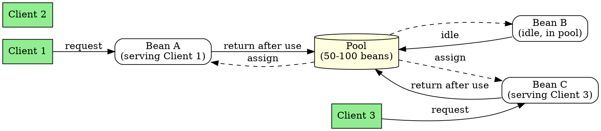

## The Problem

Creating (`new Object()`) and destroying (Garbage Collection) Java objects is expensive. If 10,000 users connect, making 10,000 objects will crash the server. How can EJB handle many clients efficiently?

## Core Idea

Instance pooling is an optimization where the EJB container maintains a pool of ready-to-use bean instances. Instead of creating new objects per request, the container assigns an idle bean from the pool. After use, the bean is cleared of client data and returned to the pool.

## How It Works

1. Container pre-creates a "pool" of bean instances in memory
2. Client request arrives → container checks for free bean in pool
3. If free bean exists → assign to client, execute method
4. After execution → strip client-specific data, return bean to pool
5. If pool exhausted → container may create new bean or wait
6. If too many idle beans → container destroys some to free memory

**Client Think Time**: Humans take time between clicks (reading pages). During this time, the bean can serve other clients—huge memory savings.

## Visual Explanation

## Key Properties

- **Memory conservation**: Serve 10,000 clients with 50-100 beans
- **High performance**: Pre-created beans skip initialization phase
- **Better GC**: Fewer objects created/destroyed, less GC overhead
- **Resource sharing**: Also pools DB connections and sockets
- **Client think time**: Humans read pages, freeing beans for others
- **Applies to**: Stateless session beans, entity beans (not stateful)

## Connections

- Built from: [[stateless-session-bean|Stateless Session Bean]], [[ejb-container|EJB Container]]
- Built from: [[resource-pooling|Resource Pooling]] — broader concept including DB connections
- Builds into: [[entity-bean|Entity Bean]] — entity beans also pooled
- Related: [[getprimarykey|getPrimaryKey()]], [[entity-context|Entity Context]]
- Related: [[client-think-time|Client Think Time]] — key enabler of pooling efficiency

## Edge Cases & Gotchas

- **Stateful session beans**: Cannot be pooled (each has dedicated client state)
- **Pool size**: Container-specific configuration; too small = wait, too large = waste
- **State clearing**: Container must strip client data before returning to pool
- **Crash**: Server crashes bypass normal pool return—may lose state
- **Database connections**: Also pooled separately from bean instances