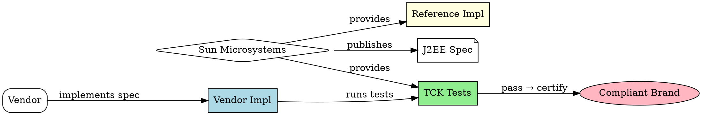
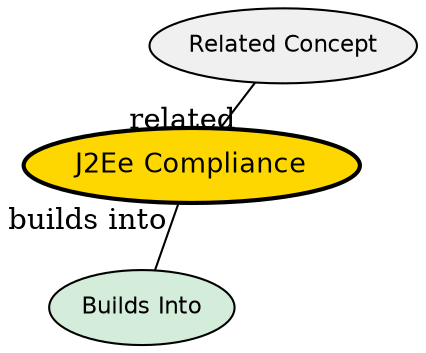

## The Problem
How do customers know if a vendor's application server truly implements all J2EE APIs correctly? Vendors might claim compliance but cut corners or implement APIs incorrectly. We need a standardized way to verify and certify implementations.

## Core Idea
J2EE compliance is achieved when a vendor's product passes the Test Compatibility Kit (TCK) provided by Sun. Compliant products earn the "J2EE-compliant" brand, assuring customers that the product correctly implements the specification.

## How It Works
1. Sun provides three things: Specifications (PDFs), TCK (test suite), and RI (reference implementation)
2. Vendor implements all J2EE APIs (EJB, JMS, JDBC, etc.)
3. Vendor runs TCK tests against their implementation
4. If all tests pass, Sun issues J2EE compliance certification
5. Customers can check reviews (e.g., TheServerSide.com) to compare compliant products

Compliance encourages competition while ensuring code portability.

## Visual Explanation

## Key Properties
- **TCK (Test Compatibility Kit)**: Comprehensive test suite from Sun
- **Certification**: "J2EE-compliant" brand issued by Sun
- **Reference Implementation**: Free, low-end implementation for developers
- **Vendor competition**: Compliance encourages innovation and price competition
- **Customer confidence**: Certified products guaranteed to work per spec

## Semantic Network

## Connections
- Built from: [[j2ee-specification|J2EE Specification]] -- compliance verifies spec implementation
- Builds into: [[ejb-container|EJB Container]] -- containers must be J2EE-compliant
- Related: [[java-platforms|Java Platforms]] -- compliance applies to J2EE platform
- Related: [[component-architecture-soa|Component Architecture]] -- compliant servers implement component model

## Edge Cases & Gotchas
- **Incompatibilities**: Ambiguities in spec can cause vendor differences despite compliance
- **Human nature of competition**: Vendors may interpret ambiguous specs differently
- **Version lag**: Some vendors slow to implement new J2EE versions
- **Proprietary extensions**: Vendors add features beyond spec, creating lock-in