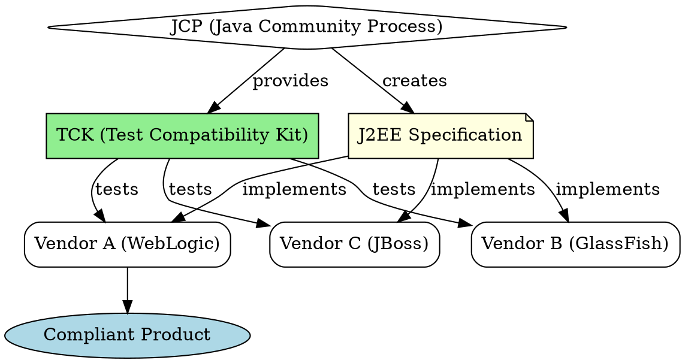

## The Problem
Enterprise software needs a standard set of APIs and behaviors so that applications work across different vendor implementations. Without a specification, each vendor creates proprietary, incompatible systems, locking customers into a single vendor.

## Core Idea
J2EE is a specification (a set of rules/PDFs), not a product. It defines the APIs and behaviors that vendors must implement to be "J2EE-compliant." This ensures portability across different application servers (WebLogic, GlassFish, JBoss).

## How It Works
1. JCP (Java Community Process) creates the specification documents (PDFs)
2. Each specification version locks down specific API versions (EJB 2.1, Servlet 2.4, etc.)
3. Vendors implement the specification in their products
4. Sun provides a Test Compatibility Kit (TCK) to verify compliance
5. Compliant products can be certified and branded as "J2EE-compliant"

J2EE 1.4 bundles EJB 2.1, JMS 1.1, JTA 1.0, etc. as the de facto versions.

## Visual Explanation

## Key Properties
- **Not a product**: Specification is a document, not software you run
- **Vendor-neutral**: Not tied to one vendor, encourages competition
- **Portable**: Code runs on any compliant server
- **Versioned**: Each J2EE version bundles specific API versions
- **Community-driven**: Created by JCP with industry experts

## Connections
- Built from: [[component-architecture-soa|Component Architecture & SOA]] — J2EE implements component architecture
- Builds into: [[ejb-container|EJB Container]] — EJB is part of J2EE
- Related: [[j2ee-compliance|J2EE Compliance]] — how vendors prove they implement the spec
- Related: [[java-platforms|Java Platforms]] — J2EE is one of three Java platforms
- Contrasts with: [[proprietary-system|Proprietary System]] — J2EE is open standard

## Edge Cases & Gotchas
- **Ambiguities**: Specifications may have ambiguous points leading to vendor differences
- **Version mismatches**: Mixing APIs from different J2EE versions causes issues
- **Vendor extensions**: Vendors may add proprietary features beyond the spec
- **Compliance != Compatibility**: Technically compliant products may still differ

## Sources
- [[ejb6-summary|EJB6 Source Summary]]
