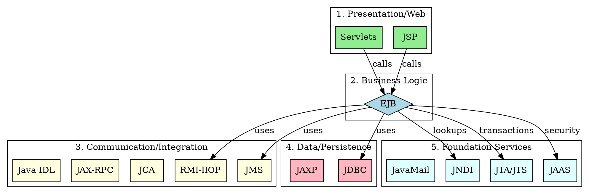

## The Problem
J2EE has many APIs (EJB, JMS, JDBC, JNDI, Servlets, JSP, etc.). Students often memorize them as a random list. How do we organize them into a logical structure that shows relationships and purposes?

## Core Idea
J2EE technologies can be grouped into 5 logical layers: Presentation/Web, Business Logic, Communication/Integration, Data/Persistence, and Foundation Services. This layered view shows how technologies relate and depend on each other.

## Comparison by Layer

### 1. Presentation / Web Technologies (Client-Facing)
| Technology | Purpose | Key Characteristic |
|------------|---------|-------------------|
| **Servlets** | HTTP request/response handling | Java classes, foundation of web tier |
| **JSP** | Dynamic HTML generation | Compiles to servlets, HTML-centric |

**Relationship**: JSP compiles to servlets. Both handle web requests but JSP separates UI from logic.

### 2. Business Logic Layer (The Brain)
| Technology | Purpose | Key Characteristic |
|------------|---------|-------------------|
| **EJB** | Server-side business components | Container-managed services (transactions, security) |

**Relationship**: EJB is the cornerstone of J2EE. Servlets/JSP often call EJBs for business logic.

### 3. Communication & Integration
| Technology | Purpose | Key Characteristic |
|------------|---------|-------------------|
| **RMI-IIOP** | Synchronous distributed objects | Official J2EE remoting, CORBA-compatible |
| **JMS** | Asynchronous messaging | Two domains: PTP (Queue) and Pub/Sub (Topic) |
| **JCA** | Legacy system integration | Resource adapters for SAP, CICS, etc. |
| **JAX-RPC** | Web Services (SOAP) | Two endpoint models (servlet or EJB-based) |
| **Java IDL** | CORBA integration | Cross-language communication |

**Relationship**: RMI-IIOP is used by EJBs for remoting. JMS provides async alternative. JCA connects to legacy. JAX-RPC for web services.

### 4. Data & Persistence
| Technology | Purpose | Key Characteristic |
|------------|---------|-------------------|
| **JDBC** | Relational database access | Universal API, works with any RDBMS |
| **JAXP** | XML parsing | Implementation-neutral (DOM/SAX) |

**Relationship**: EJBs often use JDBC for database access. JAXP for XML data in web services.

### 5. Foundation Services (Middleware)
| Technology | Purpose | Key Characteristic |
|------------|---------|-------------------|
| **JNDI** | Naming and directory | Location transparency, unified API for all directories |
| **JTA/JTS** | Transactions | Distributed transactions across resources |
| **JAAS** | Security | Pluggable authentication and authorization |
| **JavaMail** | Email | Platform-independent email sending |

**Relationship**: JNDI is used by EJBs to look up resources. JTA provides transactions. JAAS provides security.

## Visual Explanation

## Key Insights
1. **Layered dependency**: Presentation → Business → Integration → Data, with Foundation Services supporting all layers
2. **EJB is central**: Most technologies either support EJBs or are used by them
3. **Two communication paradigms**: Synchronous (RMI-IIOP) vs Asynchronous (JMS)
4. **Modern equivalent**: Spring Boot simplifies this by embedding many of these (Spring Data = JDBC, Spring Security = JAAS, etc.)
5. **Exam strategy**: Group by layer, not alphabetically—shows understanding of architecture

## Connections
- All technology pages listed above:
  - [[servlets|Servlets]], [[jsp|JSP]]
  - [[session-bean|Session Bean]], [[entity-bean|Entity Bean]], [[message-driven-bean|Message-Driven Bean]]
  - [[rmi-iiop|RMI-IIOP]], [[jms|JMS]], [[jca|JCA]], [[jax-rpc|JAX-RPC]], [[java-idl|Java IDL]]
  - [[jdbc|JDBC]], [[jaxp|JAXP]]
  - [[jndi|JNDI]], [[jta-jts|JTA/JTS]], [[jaas|JAAS]], [[javamail|JavaMail]]
- Related: [[java-platforms|Java Platforms]] — all are part of J2EE
- Related: [[middleware|Middleware]] — foundation services are middleware

## Edge Cases & Gotchas
- **Overlap**: Some technologies span layers (JNDI is used in web tier too)
- **Version differences**: J2EE 1.4 vs Java EE 5+ have different API versions
- **Modern replacements**: JAX-RPC → JAX-WS, Java IDL rarely used today
- **Spring alternative**: Modern apps use Spring which abstracts many of these

## Sources
- [[ejb6-summary|EJB6 Source Summary]]
