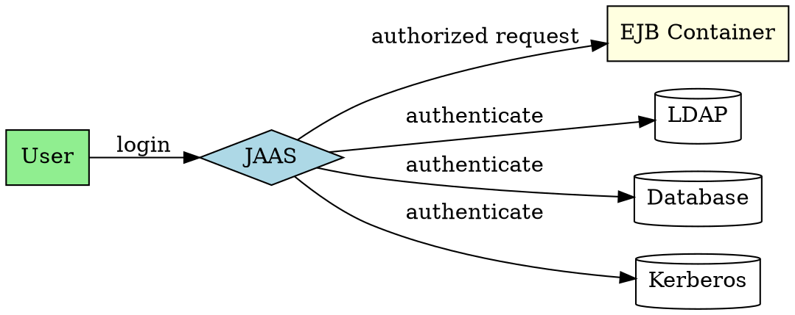

## The Problem
J2EE applications need standardized security: verifying who the user is (authentication) and what they're allowed to do (authorization). Without a standard API, each application implements security differently, leading to inconsistencies and security holes.

## Core Idea
JAAS (Java Authentication and Authorization Service) is the standard API for performing security operations in J2EE. It enables plugging in authentication mechanisms into J2EE application servers and provides both authentication and authorization services.

## How It Works
1. **Authentication**: Verifies user identity (login, password, certificates, etc.)
2. **Authorization**: Determines what authenticated user can do (roles, permissions)
3. **Pluggable**: Different authentication mechanisms can be plugged in (LDAP, database, Kerberos, etc.)
4. **J2EE integration**: Works with EJB security (Chapter 13 covers EJB security details)
5. **Standard API**: Part of J2EE platform

JAAS uses a callback mechanism for authentication and Policy-based authorization.

## Visual Explanation

## Key Properties
- **Pluggable authentication**: Swap auth mechanisms without code changes
- **Authentication + Authorization**: Both identity and permissions
- **J2EE standard**: Part of J2EE platform
- **Callback-based**: Flexible authentication dialog
- **Policy-based**: Authorization via security policies

## Connections
- Built from: [[ejb-container|EJB Container]] — container uses JAAS for EJB security
- Related: [[java-platforms|Java Platforms]] — JAAS is part of J2EE
- Builds into: [[application-vs-system-exceptions|Application vs System Exceptions]] — security exceptions
- Related: [[middleware|Middleware]] — security is a middleware service

## Edge Cases & Gotchas
- **Configuration complexity**: JAAS config files can be tricky
- **Callback handling**: Custom callbacks need careful implementation
- **Policy management**: Authorization policies must be properly configured
- **Chapter 13**: See EJB-specific security details there

## Sources
- [[ejb6-summary|EJB6 Source Summary]]
