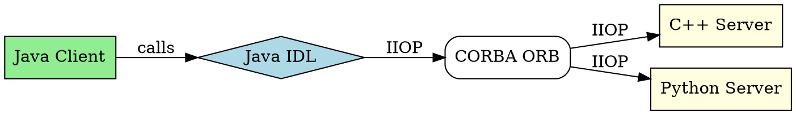

# Java IDL

## The Problem
Java applications need to communicate with objects written in other languages (C++, Python, etc.) in a distributed environment. CORBA is the standard for cross-language distributed objects, but Java needs a way to participate in CORBA ecosystems.

## Core Idea
Java IDL is Sun's Java-based implementation of CORBA (Common Object Request Broker Architecture). It allows Java objects to integrate with other languages through CORBA services, making J2EE fully compatible with CORBA.

## How It Works
1. **IDL (Interface Definition Language)**: Language-neutral way to define interfaces
2. **Java IDL**: Maps IDL interfaces to Java interfaces
3. **CORBA ORB**: Object Request Broker handles cross-language communication
4. **IIOP protocol**: Internet Inter-ORB Protocol for CORBA communication
5. **J2EE compatibility**: Full CORBA compatibility completes Java 2 Platform

Appendix B of the source discusses CORBA interoperability in detail.

## Visual Explanation

## Key Properties
- **Cross-language**: Java can talk to C++, Python, etc.
- **CORBA standard**: Implements CORBA 2.x specification
- **IIOP protocol**: Standard wire protocol for CORBA
- **J2EE integration**: Part of J2EE platform
- **Full CORBA services**: Leverages complete CORBA service set

## Connections
- Built from: [[rmi-remote-method-invocation|RMI]] — similar concept, Java-only vs cross-language
- Related: [[rmi-iiop|RMI-IIOP]] — RMI over IIOP protocol (used in J2EE)
- Builds into: [[distributed-objects|Distributed Objects]] — Java IDL enables cross-language distributed objects
- Related: [[java-platforms|Java Platforms]] — Java IDL is part of J2EE

## Edge Cases & Gotchas
- **Legacy technology**: CORBA/IDL largely replaced by REST/JSON
- **Complexity**: CORBA has steep learning curve
- **IIOP firewall issues**: IIOP may be blocked by firewalls
- **Modern alternative**: Use REST or gRPC for cross-language communication

## Sources
- [[ejb6-summary|EJB6 Source Summary]]
