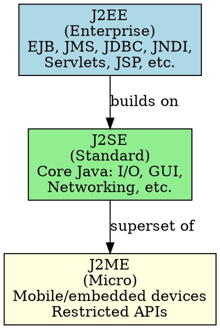

# Java Platforms

## The Problem
Java targets different types of devices and use cases: tiny mobile devices, standard desktop applications, and large enterprise servers. One-size-fits-all doesn't work—each needs different APIs and capabilities. How does Java organize its platform offerings?

## Core Idea
Java has three platforms in a hierarchical relationship: J2ME (Micro Edition) for mobile/embedded, J2SE (Standard Edition) for desktop/apps, and J2EE (Enterprise Edition) for server-side enterprise applications. Each platform is a conceptual superset of the next smaller platform.

## How It Works
1. **J2ME** (Micro Edition): Restricted Java for mobile devices (phones, PDAs, set-top boxes). Limited APIs due to performance/memory constraints.
2. **J2SE** (Standard Edition): Core Java libraries (I/O, GUI, networking). Foundation for all Java development.
3. **J2EE** (Enterprise Edition): Builds on J2SE, adds enterprise APIs (EJB, JMS, JDBC, etc.). Conceptual superset of J2SE.

A J2EE-compliant product must implement all of J2SE plus the J2EE-specific APIs.

## Visual Explanation

## Key Properties
- **Hierarchical**: J2EE ⊃ J2SE ⊃ J2ME (conceptual superset)
- **J2SE foundation**: All platforms build on standard Java core
- **J2EE barrier to entry**: Implementing J2EE is huge undertaking (includes all J2SE + enterprise APIs)
- **Industry consolidation**: High barrier led to few major J2EE players
- **J2ME restrictions**: Limited by device memory and processing power

## Connections
- Builds into: [[j2ee-specification|J2EE Specification]] — J2EE is one platform
- Built from: [[component-architecture-soa|Component Architecture]] — J2EE implements this
- Related: [[ejb-container|EJB Container]] — EJB is part of J2EE
- Related: [[j2ee-compliance|J2EE Compliance]] — compliance applies to J2EE platform

## Edge Cases & Gotchas
- **"Conceptual superset"**: Not strict subset/superset in code terms
- **J2SE in J2EE**: J2EE products must pass J2SE tests too
- **Modern names**: J2ME → Java ME, J2SE → Java SE, J2EE → Java EE
- **Android**: Not part of this hierarchy—uses different APIs

## Sources
- [[ejb6-summary|EJB6 Source Summary]]
