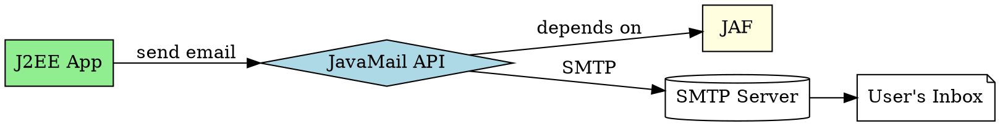

## The Problem
J2EE applications often need to send email notifications (order confirmations, password resets, alerts). Without a standard API, developers must deal with vendor-specific email protocols (SMTP, POP3, IMAP) directly.

## Core Idea
JavaMail enables sending email messages in a platform-independent, protocol-independent manner from Java programs. It depends on JavaBeans Activation Framework (JAF), which also becomes part of J2EE.

## How It Works
1. **Protocol-independent**: Works with SMTP, POP3, IMAP without code changes
2. **Session creation**: Obtain `javax.mail.Session` (often via JNDI)
3. **Message construction**: Create `MimeMessage` with subject, body, recipients
4. **Transport**: Use `Transport.send()` to send the message
5. **J2EE integration**: Use in servlets, JSP, or EJB components

Example: Send order confirmation email from an e-commerce site.

## Visual Explanation

## Key Properties
- **Platform-independent**: Works on any Java platform
- **Protocol-independent**: Supports SMTP, POP3, IMAP
- **JAF dependency**: Requires JavaBeans Activation Framework
- **J2EE standard**: Part of J2EE platform
- **Server-side use**: Commonly used in J2EE deployments

## Connections
- Built from: [[java-platforms|Java Platforms]] — JavaMail is part of J2EE
- Related: [[ejb-container|EJB Container]] — EJB components can use JavaMail
- Related: [[servlets|Servlets]] — servlets commonly send emails
- Related: [[jsp|JSP]] — JSP pages can trigger email sending

## Edge Cases & Gotchas
- **JAF required**: Forgetting JAF causes ClassNotFound errors
- **SMTP configuration**: Must configure SMTP host correctly
- **Authentication**: SMTP may require username/password
- **Not covered**: The source book does not cover JavaMail in detail

## Sources
- [[ejb6-summary|EJB6 Source Summary]]
