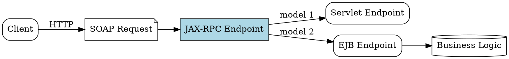

## The Problem
Java applications need to build and consume web services (SOAP-based) in a standardized way. Without a common API, each developer would implement SOAP/XML parsing differently, leading to interoperability issues.

## Core Idea
JAX-RPC (Java API for XML RPC) is the main technology for developing web services on J2EE. It defines two endpoint models: one based on servlet technology and another based on EJB. It specifies runtime requirements for web service support in J2EE.

## How It Works
1. **Endpoint models**: Servlet-based (easier) and EJB-based (full container services)
2. **SOAP messaging**: JAX-RPC handles SOAP request/response serialization
3. **WSDL support**: Generates and parses WSDL descriptions
4. **Deployment**: "Web Services for J2EE" spec defines deployment requirements using JAX-RPC programming model
5. **J2EE integration**: Works with J2EE security, transactions, and lifecycle

Chapter 5 of the source book discusses JAX-RPC support for EJB applications.

## Visual Explanation

## Key Properties
- **SOAP-based**: Uses SOAP protocol for XML RPC
- **Two endpoint models**: Servlet (simple) and EJB (full services)
- **J2EE standard**: Part of J2EE 1.4 specification
- **WSDL integration**: Works with WSDL service descriptions
- **Runtime requirements**: Specifies how containers must support web services

## Connections
- Built from: [[ejb-container|EJB Container]] — EJB endpoint model uses container services
- Related: [[java-platforms|Java Platforms]] — JAX-RPC is part of J2EE
- Builds into: [[web-services|Web Services]] — JAX-RPC enables web service development
- Contrasts with: [[rest|REST]] — JAX-RPC is SOAP/XML, REST is simpler HTTP

## Edge Cases & Gotchas
- **Deprecated**: JAX-RPC replaced by JAX-WS in modern Java EE
- **SOAP complexity**: XML serialization has overhead
- **EJB endpoint overhead**: Full container services may be unnecessary for simple services
- **WS-* standards**: Many additional specs beyond core JAX-RPC

## Sources
- [[ejb6-summary|EJB6 Source Summary]]
