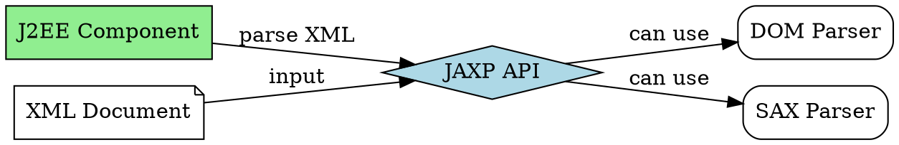

# JAXP

## The Problem
J2EE applications frequently need to parse XML documents (for B2B interactions, legacy system data mapping, or persisting XML to databases). Without a standard API, developers use different XML parsers inconsistently, leading to vendor lock-in and portability issues.

## Core Idea
JAXP (Java API for XML Parsing) is the de facto API for parsing XML documents in J2EE applications. It's implementation-neutral, working with various XML parsing technologies like DOM and SAX.

## How It Works
1. **Implementation-neutral**: JAXP API works with any compliant parser (Xerces, Crimson, etc.)
2. **DOM parsing**: Loads entire XML into memory as a tree (good for small docs, random access)
3. **SAX parsing**: Event-based, reads XML sequentially (good for large docs, memory-efficient)
4. **Used from**: Servlets, JSP, or EJB components
5. **J2EE standard**: Part of J2EE platform

Common use cases: B2B Web Services (SOAP uses XML), legacy data mapping, XML persistence.

## Visual Explanation

## Key Properties
- **Implementation-neutral**: Switch parsers without changing code
- **DOM support**: Tree-based parsing for random access
- **SAX support**: Event-based parsing for large documents
- **J2EE standard**: Part of J2EE platform
- **Widely used**: SOAP, B2B, XML persistence all use JAXP

## Connections
- Built from: [[java-platforms|Java Platforms]] — JAXP is part of J2EE
- Related: [[jax-rpc|JAX-RPC]] — JAX-RPC uses XML/SOAP (parsed by JAXP)
- Builds into: [[web-services|Web Services]] — XML parsing is core to web services
- Related: [[ejb-container|EJB Container]] — EJB components can use JAXP

## Edge Cases & Gotchas
- **DOM memory**: Large XML docs can cause OutOfMemoryError with DOM
- **SAX complexity**: Event-based model is harder to program
- **Parser configuration**: Must ensure correct parser is on classpath
- **Namespace support**: Proper namespace handling requires care

## Sources
- [[ejb6-summary|EJB6 Source Summary]]
