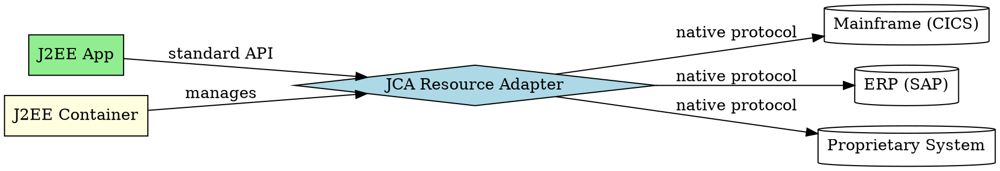

# J2EE Connector Architecture

## The Problem
Enterprises have existing systems (mainframes with CICS/TUXEDO, ERP systems like SAP/Siebel, proprietary systems) that J2EE applications need to access. Without a standard way to connect, each vendor writes custom, incompatible integrations, leading to maintenance nightmares.

## Core Idea
JCA (J2EE Connector Architecture) enables J2EE applications to access existing enterprise information systems (EIS) through standard resource adapters. Write once, deploy to any J2EE-compliant server. Handles transactions, security, lifecycle, and thread management automatically.

## How It Works
1. **Resource Adapter**: JCA-compliant adapter for the EIS (like SAP adapter)
2. **System Contracts**: Adapter implements contracts for connection management, transaction management, and security
3. **Application**: Uses standard J2EE APIs to call the adapter
4. **Container manages**: Transactions, security, lifecycle, threading handled by container
5. **Portable**: Deploy same adapter to any J2EE-compliant server

Chapter 17 discusses legacy integration in more detail.

## Visual Explanation

## Key Properties
- **Write once, run anywhere**: Single adapter works on all J2EE servers
- **Container-managed**: Transactions, security, lifecycle handled by container
- **ISV benefit**: Independent Software Vendors (SAP, Siebel) write one adapter
- **Standard contracts**: Connection, transaction, security contracts defined by JCA spec
- **Legacy integration**: Bridges modern J2EE with legacy systems

## Connections
- Built from: [[ejb-container|EJB Container]] — container manages JCA adapters
- Related: [[java-platforms|Java Platforms]] — JCA is part of J2EE
- Builds into: [[message-driven-bean|Message-Driven Bean]] — JCA 1.5+ supports MDB for non-JMS messages
- Related: [[middleware|Middleware]] — JCA is middleware for legacy integration

## Edge Cases & Gotchas
- **Adapter quality**: Poorly written adapters can cause issues
- **Transaction propagation**: XA transactions across EIS systems can be complex
- **Connection pooling**: Adapter must properly implement connection management
- **JCA versions**: JCA 1.5 added Message Inflow (for MDBs)

## Sources
- [[ejb6-summary|EJB6 Source Summary]]
