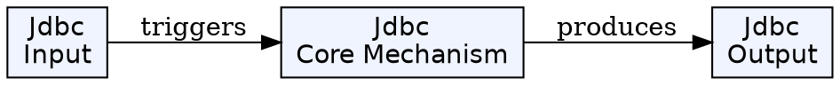
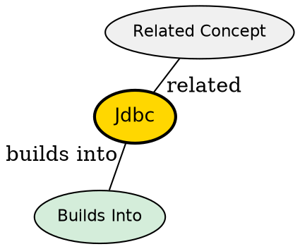

## The Problem

How do Java applications interact with relational databases in a portable way, without being tied to specific database products?

## Core Idea

JDBC (Java Database Connectivity) is a standard Java API that provides universal database access. Applications use the JDBC API, while database-specific JDBC drivers handle the actual communication with each database.

## How It Works

- Application uses JDBC API to issue SQL statements
- JDBC Driver Manager selects the appropriate driver for the database
- Driver translates JDBC calls to database-specific protocol
- Results are returned through standard JDBC result sets

## Key Properties

- Part of Java SE standard edition
- Drivers for all major databases (MySQL, Oracle, PostgreSQL, etc.)
- Supports connection pooling through DataSource
- SQL statements via Statement, PreparedStatement, CallableStatement

## Visual Explanation

## Semantic Network

## Connections

- Built from: [[bean-managed-persistence|Bean-Managed Persistence]]
- Related: [[ejbload|ejbLoad()]], [[ejbstore|ejbStore()]], [[ejbcreate|ejbCreate()]], [[ejbremove|ejbRemove()]]
- Related: [[session-bean-relationships|Session Bean Relationships]], [[one-to-one-relationship|One-to-One Relationship]]

## Edge Cases & Gotchas

- Must close connections, statements, and result sets properly
- Use PreparedStatement to prevent SQL injection