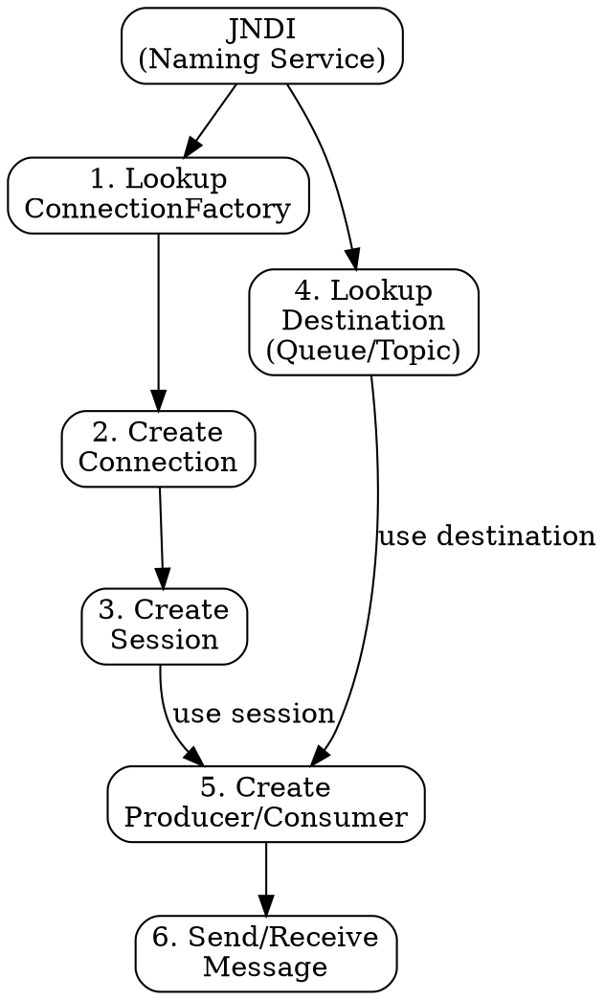

## The Problem
JMS has many interfaces (ConnectionFactory, Connection, Session, Destination, Producer, Consumer) and a developer needs to understand the correct order to use them. Without a clear step-by-step model, the API feels overwhelming and error-prone.

## Core Idea
The JMS programming model is a 6-step pipeline: lookup ConnectionFactory → create Connection → create Session → lookup Destination → create Producer/Consumer → send/receive messages. Think of it like a water supply system: factory makes the pipe, connection is the pipe, session is the valve, destination is the tank, producer/consumer is the pump.

## How It Works
1. **Lookup ConnectionFactory via JNDI:** Get the factory object configured by administrator
2. **Create Connection:** Use factory to create an active connection to the JMS provider (like a JDBC connection)
3. **Create Session:** Use connection to create a session — helper for creating producers/consumers and wrapping messages in transactions
4. **Lookup Destination via JNDI:** Get the Queue or Topic destination (configured by deployer)
5. **Create Producer or Consumer:** Use session + destination to create a `QueueSender`/`TopicPublisher` or `QueueReceiver`/`TopicSubscriber`
6. **Send or Receive Message:** Producer sends message to destination; Consumer receives from destination

## Visual Explanation

## Key Properties
- Session serves as factory for producers/consumers and enables transaction wrapping
- Connection represents physical network connection to JMS provider (may be load-balanced)
- Destination is the channel (Queue or Topic) — looked up by name in JNDI
- Producer sends messages; Consumer receives messages — both created from Session
- Two flavors: `Queue*` interfaces for PTP, `Topic*` interfaces for Pub/Sub

## Connections
- Built from: [[jms|JMS]] — the programming model implements the JMS API
- Built from: [[jndi|JNDI]] — steps 1 and 4 require JNDI lookups
- Builds into: [[message-driven-bean|MDB]] — MDBs are the server-side consumer of messages
- Related: [[point-to-point-vs-pub-sub|PTP vs Pub/Sub]] — determines which interfaces to use
- Related: [[jdbc|JDBC]] — similar pattern: factory → connection → statement

## Edge Cases & Gotchas
- Forgetting to close Connection/Session causes resource leaks
- Session is NOT thread-safe — one session per thread
- JNDI lookups (steps 1 and 4) can be expensive — cache them if possible
- Transactions are per-session, not per-connection
- Using wrong interface flavor (Queue vs Topic) for your destination causes runtime errors