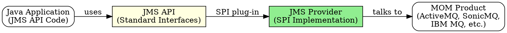

# Java Message Service (JMS)

## The Problem
Message-Oriented Middleware (MOM) products like IBM MQ, MSMQ, and SonicMQ each had proprietary APIs. Developers had to rewrite code for each MOM vendor, creating vendor lock-in and forcing developers to learn multiple APIs.

## Core Idea
JMS is a standard Java API for messaging that abstracts vendor-specific MOM implementations. You write code against the JMS API once, and plug in any compliant JMS provider (MOM implementation) without changing your code — similar to how JDBC abstracts database vendors.

## How It Works
1. **JMS API:** Developer writes messaging code using standard JMS interfaces
2. **Service Provider Interface (SPI):** JMS providers (like ActiveMQ, SonicMQ) implement the SPI to connect JMS API to their MOM product
3. **JNDI Lookup:** Client looks up `ConnectionFactory` and `Destination` from JNDI (administrator configures these)
4. **Message Types:** JMS supports TextMessage, BytesMessage, StreamMessage, ObjectMessage, and MapMessage
5. **Two messaging domains:** Point-to-Point (Queues) and Publish/Subscribe (Topics) — each has its own interface flavor

## Visual Explanation

## Key Properties
- Standardized API — write once, run with any JMS provider
- Two separate interface flavors: PTP (`QueueConnection`, `QueueSession`) and Pub/Sub (`TopicConnection`, `TopicSession`)
- Core interfaces: ConnectionFactory, Connection, Session, Destination, Producer, Consumer
- MOM products provide guaranteed delivery, fault tolerance, load balancing
- Abstractions away low-level concerns: networking protocol, message format, server location

## Connections
- Built from: [[message-oriented-middleware|MOM]] — JMS is an API abstraction over MOM products
- Builds into: [[message-driven-bean|MDB]] — MDBs consume JMS messages via `onMessage()`
- Related: [[jndi|JNDI]] — JMS uses JNDI to look up ConnectionFactory and Destination
- Contrasts with: [[rmi-remote-method-invocation|RMI-IIOP]] — RMI is synchronous; JMS is asynchronous
- Related: [[jms-programming-model|JMS Programming Model]] — step-by-step process to send/receive messages

## Edge Cases & Gotchas
- JMS 1.0 had separate PTP and Pub/Sub interfaces; JMS 1.1 unified them (but EJB 2.x uses 1.0 style)
- Not all MOM features are exposed through JMS — some vendor-specific features need proprietary APIs
- JMS providers must be configured by administrator before application can use them
- ConnectionFactory and Destination must be looked up via JNDI — they are not created programmatically

## Sources
- [[EJb4-summary|EJb4.md Source Summary]]
