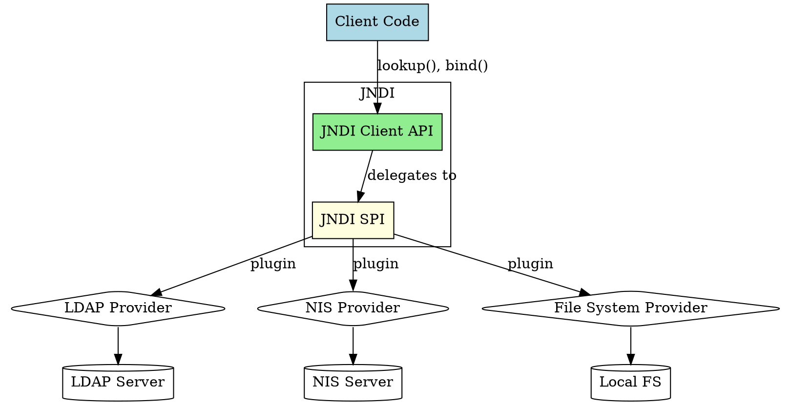

## The Problem
Java applications need to access different naming and directory services (LDAP, NIS, Novell NDS), but each has its own protocol and API. Learning and coding to multiple vendor-specific APIs is complex and creates vendor lock-in. How can we provide a single, unified interface?

## Core Idea
JNDI has a two-part architecture: the Client API (for application developers) and the Service Provider Interface or SPI (for vendor implementations). The Client API provides a uniform interface for all directory operations, while the SPI allows vendors to plug in their specific protocols behind a common interface.

## How It Works
1. **Client API layer**: Application code uses `javax.naming` classes (`InitialContext`, `Context`) to perform lookups, bindings, and searches
2. **SPI layer**: Vendors implement `javax.naming.spi` interfaces to bridge JNDI calls to their specific protocols
3. **Service Providers**: LDAP provider maps JNDI calls to LDAP protocol; NIS provider maps to NIS protocol, etc.
4. **Pluggable architecture**: Swap providers without changing application code
5. **J2EE integration**: J2EE servers bundle custom JNDI implementations, often fault-tolerant and integrated with other services (RMI-IIOP, JDBC, JMS)

Analogous to JDBC: Client API = JDBC API; SPI = JDBC Drivers.

## Visual Explanation

## Key Properties
- **Unified API**: Single API for all directory types (LDAP, NIS, NDS, filesystem)
- **Protocol insulation**: Application code doesn't know or care about underlying protocol
- **Pluggable providers**: Vendors implement SPI to support their directory service
- **Federated directories**: Combine multiple directories (LDAP + NDS) into one logical view
- **Portable**: Code works across different JNDI implementations
- **J2EE integration**: Used for EJB lookups, DataSource lookups, JMS connection factories

## Connections
- Built from: [[jndi|JNDI]] — JNDI is the naming service this architecture implements
- Builds into: [[ejb-naming-service|EJB Naming Service]] — EJB uses JNDI for bean lookups
- Contrasts with: [[rmi-remote-method-invocation|RMI]] — RMI Registry is narrower, JNDI is broader
- Related: [[jdbc|JDBC]] — similar API/driver architecture pattern
- Builds into: [[location-transparency|Location Transparency]] — JNDI enables location-independent lookups
- Related: [[ejb-container|EJB Container]] — containers provide JNDI implementations

## Edge Cases & Gotchas
- **Provider not found**: If the service provider class isn't on classpath, lookups fail
- **Different JNDI trees**: Each server vendor may use different JNDI naming conventions
- **Performance**: JNDI lookups have overhead; cache references when possible
- **Federated directories**: Can be complex to configure and debug
- **InitialContext**: Must be configured with correct environment properties for the provider