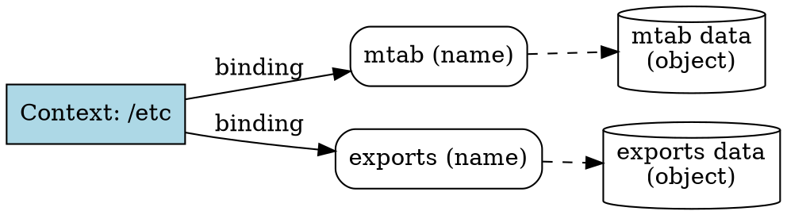

## The Problem
In a naming system, we need to associate names with objects so clients can look them up. How do we represent the association between a name (like `autoexec.bat`) and the actual object it refers to (the file data on disk)?

## Core Idea
A binding is an association of a name with an object. For example, `autoexec.bat` is bound to the file data on your hard disk. In JNDI, bindings are the fundamental associations that make up contexts—each context contains a set of bindings.

## How It Works
1. A binding maps a name (atomic name) to an object
2. In file system: `autoexec.bat` → file data on disk
3. In JNDI: `MyBean` → EJB Home Object reference
4. A compound name like `/usr/people/ed/.cshrc` consists of multiple bindings resolved sequentially
5. Bindings are created with `Context.bind(name, obj)` and looked up with `Context.lookup(name)`

## Visual Explanation

## Key Properties
- **Name → Object**: The core association in naming systems
- **Atomic name key**: Bindings are keyed by atomic names within a context
- **Mutable**: Bindings can be added, removed, or changed
- **Type-independent**: The bound object can be any Java object
- **Serializable**: Objects bound in JNDI should typically be serializable

## Connections
- Built from: [[atomic-name|Atomic Name]] — bindings use atomic names as keys
- Built from: [[jndi-context|JNDI Context]] — contexts contain bindings
- Builds into: [[compound-name|Compound Name]] — compound names resolve through multiple bindings
- Related: [[jndi-naming-concepts|JNDI Naming Concepts]] — bindings are a core concept
- Related: [[jndi|JNDI]] — JNDI provides the API for managing bindings

## Edge Cases & Gotchas
- **Overwriting bindings**: Rebinding a name replaces the existing binding
- **Null bindings**: Binding null may be allowed or may throw exception
- **Object serialization**: Bound objects must be serializable for some providers
- **Garbage collection**: Binding keeps a reference to the object (prevents GC)

## Sources
- [[ejb6-summary|EJB6 Source Summary]]
