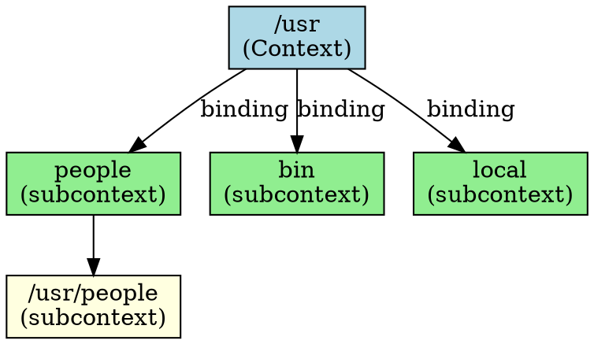

## The Problem
In a hierarchical naming system, we need containers that group related name-to-object associations together. How do we represent a "folder" in the naming tree that contains multiple bindings?

## Core Idea
A context is a set of zero or more bindings, where each binding has a distinct atomic name. In the UNIX file system, a folder like `/etc` is a context containing bindings to files like `mtab` and `exports`. Each context is also a subcontext of its parent.

## How It Works
1. Context implements `javax.naming.Context` interface
2. Contains bindings: name → object mappings
3. Operations: `lookup(name)`, `bind(name, obj)`, `unbind(name)`, `list()`
4. Subcontext: A context within a context (like `/usr/people` within `/usr`)
5. Each subcontext is a full context itself, capable of containing more bindings

In JNDI, the root context is obtained via `new InitialContext()`. Subcontexts are created with `createSubcontext()`.

## Visual Explanation

## Key Properties
- **Container of bindings**: Groups related name→object associations
- **Hierarchical**: Can contain subcontexts, forming a tree
- **Context operations**: lookup, bind, unbind, rename, list, createSubcontext
- **InitialContext**: The entry point for JNDI operations
- **Serializable**: Contexts can be bound into other contexts

## Connections
- Built from: [[jndi-binding|JNDI Binding]] — contexts contain bindings
- Built from: [[jndi-naming-concepts|JNDI Naming Concepts]] — contexts are central to JNDI
- Builds into: [[subcontext|Subcontext]] — a context within a context
- Related: [[jndi|JNDI]] — JNDI provides the Context API
- Related: [[atomic-name|Atomic Name]] — bindings in a context have atomic names

## Edge Cases & Gotchas
- **Closing contexts**: Always close contexts to free resources
- **Concurrent access**: Context operations may not be thread-safe
- **Lazy loading**: Large contexts may not load all bindings immediately
- **Context destruction**: Destroying a context may not recursively destroy subcontexts

## Sources
- [[ejb6-summary|EJB6 Source Summary]]
