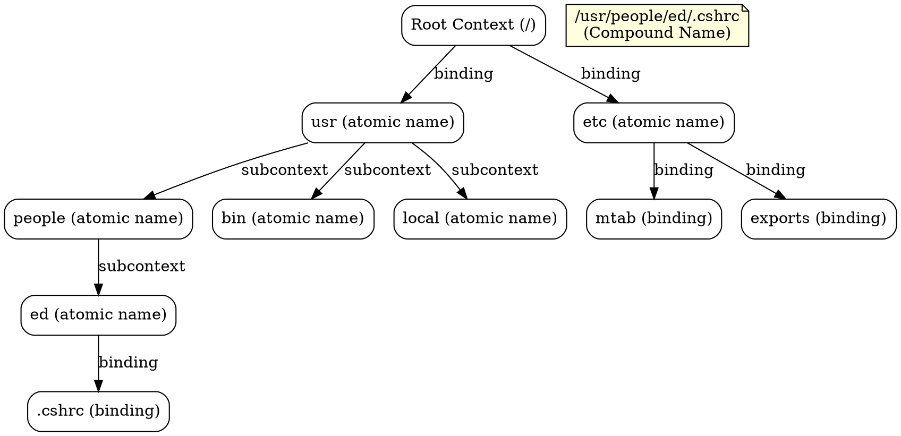

## The Problem
JNDI organizes names and objects in a tree structure similar to a file system. Without understanding the fundamental naming concepts (atomic names, compound names, bindings, contexts), developers cannot effectively navigate or manipulate the JNDI directory tree.

## Core Idea
JNDI uses a hierarchical naming model with five key concepts: atomic names (indivisible), compound names (combinations), bindings (name→object associations), contexts (sets of bindings), and subcontexts (contexts within contexts). This mirrors the file system model.

## How It Works
1. **Atomic Name**: A simple, indivisible name (e.g., `etc`, `fstab`, `usr`)
2. **Compound Name**: Multiple atomic names combined with syntax (`/etc/fstab`, `/usr/bin`)
3. **Binding**: Association of a name with an object (`autoexec.bat` → file data)
4. **Context**: A set of bindings with distinct atomic names (`/etc` contains `mtab`, `exports`)
5. **Subcontext**: A context within a context (`/usr/people` is a subcontext of `/usr`)

A compound name like `/usr/people/ed/.cshrc` represents multiple bindings resolved sequentially through the tree.

## Visual Explanation

## Key Properties
- **Tree structure**: Hierarchical, like a file system
- **Atomic names**: Cannot be subdivided further
- **Compound names**: Path-like combinations of atomic names
- **Bindings**: Name-to-object mappings, core of JNDI operations
- **Contexts**: Containers for bindings, can be nested (subcontexts)
- **JNDI compound names**: Can use different syntaxes (slash, dot, etc.)

## Connections
- Built from: [[jndi|JNDI]] — JNDI implements these naming concepts
- Builds into: [[jndi-context|JNDI Context]] — contexts are central to JNDI operations
- Related: [[jndi-binding|JNDI Binding]] — bindings are the associations within contexts
- Related: [[atomic-name|Atomic Name]], [[compound-name|Compound Name]]
- Related: [[subcontext|Subcontext]] — subcontexts enable hierarchical organization

## Edge Cases & Gotchas
- **Compound name syntax**: Different providers may use different separators
- **Reserved characters**: Some characters may need escaping in names
- **Context destruction**: Destroying a context may not destroy its subcontexts
- **Lazy loading**: Large contexts may load bindings lazily
- **Compound name parsing**: Be careful with provider-specific parsing rules

## Sources
- [[ejb6-summary|EJB6 Source Summary]]
