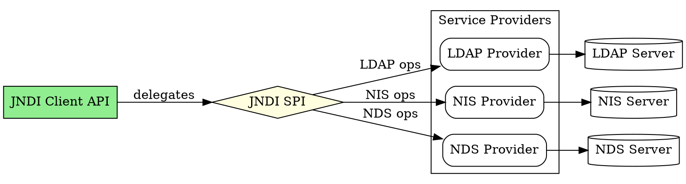
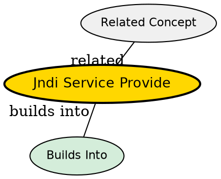

## The Problem
JNDI defines a common client API, but how do different directory vendors (LDAP, NIS, Novell) make their services accessible through that API? There needs to be a standardized way for vendors to plug their proprietary protocols into the JNDI framework.

## Core Idea
The JNDI SPI is a framework that naming and directory service vendors implement to bridge JNDI client API calls to their specific protocols. It's the "converse" of the API--while the API is for client developers, the SPI is for vendor implementors.

## How It Works
1. Vendor implements `javax.naming.spi` interfaces (`InitialContextFactory`, `StateFactory`, etc.)
2. Provider maps JNDI operations (lookup, bind, search) to vendor-specific protocol operations
3. For example, LDAP provider converts `ctx.lookup("cn=John")` into an LDAP search operation
4. Provider handles connection management, authentication, and protocol details
5. Client code remains unchanged regardless of which provider is plugged in

Sun provides a free LDAP service provider; vendors can write their own for proprietary directories.

## Visual Explanation

## Key Properties
- **Vendor extensibility**: Any vendor can implement a JNDI provider
- **Protocol translation**: Converts generic JNDI calls to specific protocol operations
- **Pluggable**: Replace providers without changing client code
- **Standardized**: `javax.naming.spi` package defines the contract
- **Bundled with J2EE**: Many J2EE servers bundle custom JNDI implementations

## Semantic Network

## Connections
- Built from: [[jndi-architecture|JNDI Architecture]] -- SPI is one half of JNDI
- Builds into: [[jndi|JNDI]] -- SPI enables JNDI's unified interface
- Related: [[jdbc|JDBC Drivers]] -- similar plugin architecture for databases
- Contrasts with: [[jndi-client-api|JNDI Client API]] -- SPI is for vendors, API is for developers

## Edge Cases & Gotchas
- **Provider not found**: Classpath must include the provider library
- **Version compatibility**: Provider must match JNDI version
- **Connection pooling**: Provider may or may not implement connection pooling
- **Thread safety**: Provider implementations must be thread-safe