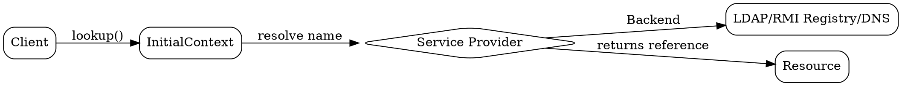

> See also: [[ejb-naming-service|EJB Naming Service]], [[location-transparency|Location Transparency]] for EJB-specific usage.

# JNDI

## The Problem
In a distributed system, how do clients locate resources like databases, EJB components, or other services? Hard-coding connection details (like IP addresses) is bad practice — we need a centralized naming service that can change without recompiling code.

## Core Idea
JNDI is a Java API that provides a unified interface for locating resources (objects, services) through a naming and directory service. It allows clients to look up resources by logical name rather than physical location, providing location independence and flexibility.

## How It Works
1. Resource (database, EJB, etc.) is bound to JNDI with a logical name
2. Client creates InitialContext
3. Client calls ctx.lookup("logicalName") to get the resource
4. JNDI communicates with underlying Service Provider
5. Service Provider (LDAP, DNS, RMI Registry, etc.) resolves the name
6. Client gets reference to resource

Common JNDI trees:
- java:comp/env — application environment
- jdbc/ — database connections
- ejb/ — EJB references

## Visual Explanation

## Key Properties
- Location independence: Change resource location without changing client code
- Decoupling: Client doesn't need to know implementation details
- Centralized: All resources registered in one place
- Generic: Works with many backends (RMI, LDAP, CORBA, etc.)
- Hierarchical: Supports nested contexts (java:comp/env/jdbc)
- Dependency injection: Can inject JNDI references automatically (EJB 3.x)

## Connections
- Built from: [[naming-service|Naming Service]] — core naming concept, [[ejb-naming-service|EJB Naming Service]] (EJB-specific usage)
- Related: [[directory-service|Directory Service]] — adds attributes to naming
- Builds into: [[ejb-container|EJB Container]] — EJB container registers beans in JNDI, [[location-transparency|Location Transparency]] (JNDI enables location-independent lookups)
- Builds into: [[home-interface|Home Interface]] (what clients look up via JNDI), [[ejb-development-lifecycle|EJB Development Lifecycle]] (step 5+: deploy, then JNDI lookup)
- Contrasts with: [[rmi-registry|RMI Registry]] — RMI Registry is a specific JNDI provider, Hard-coded addresses (JNDI is registry-based, not address-based)
- Related: [[jms-programming-model|JMS Programming Model]], [[jms|JMS]], [[cmp-abstract-accessors|CMP Abstract Accessors]], [[one-to-many-relationship|One-to-Many Relationship]], [[distributed-objects|Distributed Objects]] (clients access objects via JNDI)

## Edge Cases & Gotchas
- Multiple InitialContexts in same application can be confusing
- Different servers use different JNDI trees
- JNDI lookups have performance cost
- In EJB 3.x, @EJB annotation often replaces manual lookup
- Security: Ensure JNDI tree is properly configured in production

## Sources
- [[ejb3-summary|EJB3 Source Summary]]