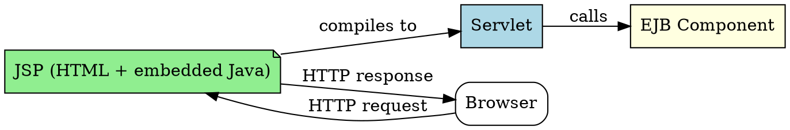

# JSP

## The Problem
Writing HTML in Java servlets is painful—Java code is mixed with HTML strings. Web designers who don't know Java need to modify the look-and-feel. How can we separate presentation from business logic?

## Core Idea
JSP (JavaServer Pages) is similar to servlets but centered on look-and-feel. JSP scripts are HTML-like with embedded Java code, compiled into servlets. They enable non-Java staff to maintain the UI separately from business logic.

## How It Works
1. **JSP script**: HTML file with embedded Java (scriptlets, expressions, declarations, directives)
2. **Lifecycle**: Translation (JSP → servlet source) → Compilation (servlet source → .class) → init() → service() → destroy()
3. **Directives**: `<%@ page %>` (page settings), `<%@ include %>` (static includes), `<%@ taglib %>` (custom tags)
4. **Scripting elements**: `<%! %>` declarations, `<% %>` scriptlets, `<%= %>` expressions
5. **EL (Expression Language)**: `${bean.property}` syntax for accessing Java beans without scriptlets
6. **JSTL**: Standard tag library (`<c:if>`, `<c:forEach>`, `<c:out>`) enabling logic without Java code
7. **Implicit objects**: request, response, session, application, out, pageContext, config, page, exception
8. **Compilation**: JSP is compiled into a servlet on first access
9. **Separation**: UI in JSP, business logic in EJB/servlets
10. **J2EE integration**: Can call EJB components, use JNDI, etc.

JSP is perfect when you want physically separate, easily maintainable UI code.

## Visual Explanation

## Key Properties
- **HTML-centric**: Looks like HTML with embedded Java
- **Compiles to servlet**: Under the hood, it's a servlet
- **Lifecycle**: Translation → Compilation → init → service → destroy
- **Directives**: page, include, taglib — control page behavior
- **EL (Expression Language)**: ${} syntax, auto-scoped attribute lookup
- **JSTL**: Core, formatting, SQL, XML, functions tag libraries
- **Implicit objects**: 9 pre-defined objects accessible in any JSP
- **No compiler needed**: At deployment time
- **Non-Java friendly**: Web designers can maintain JSPs
- **Separate maintenance**: UI separated from business logic
- **J2EE standard**: Part of J2EE platform

## Connections
- Built from: [[servlets|Servlets]] — JSP compiles to servlets
- Built from: [[java-platforms|Java Platforms]] — JSP is part of J2EE
- Builds into: [[ejb-container|EJB Container]] — JSP can call EJBs
- Related: [[jsp|JSP]] — alternative to servlets for presentation
- Contrasts with: [[session-bean|Session Bean]] — JSP is presentation, EJBs are business logic

## Edge Cases & Gotchas
- **Scriptlet pollution**: Avoid too much Java in JSP (use JSTL/EL)
- **First-access delay**: Compilation happens on first access
- **Chapter 22**: See EJB with JSP examples there
- **Modern alternative**: Consider Facelets/Thymeleaf in modern apps

## Sources
- [[ejb6-summary|EJB6 Source Summary]]
- [[java3-summary|Advanced Java Tutorial — Source Summary]] — JSP lifecycle, directives, EL, JSTL, implicit objects
