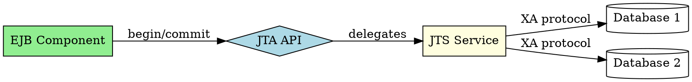

## The Problem
Distributed transactions across multiple databases or systems need coordination. Without a standard API, each vendor implements transactions differently, breaking portability and making it hard to build reliable enterprise applications.

## Core Idea
JTA (Java Transaction API) and JTS (Java Transaction Service) provide reliable transaction support for J2EE components. JTA is the API that developers use; JTS is the underlying transaction service implementation (based on CORBA OTS).

## How It Works
1. **JTA API**: Developer uses `UserTransaction` interface (looked up via JNDI)
2. **Transaction demarcation**: `begin()`, `commit()`, `rollback()` methods
3. **JTS**: Implements CORBA Object Transaction Service (OTS) specification
4. **Distributed transactions**: Coordinates transactions across multiple resources (XA protocol)
5. **Container-managed**: EJB containers can manage transactions declaratively (CMT)

Chapter 12 explains JTA/JTS in detail.

## Visual Explanation

## Key Properties
- **JTA**: API for transaction demarcation (developer-facing)
- **JTS**: Service implementation (CORBA OTS-based)
- **Distributed**: Coordinates across multiple resources
- **XA support**: Two-phase commit protocol
- **J2EE standard**: Part of J2EE platform
- **CMT integration**: EJB container can manage transactions declaratively

## Connections
- Built from: [[transactions|Transactions in EJB]] — JTA/JTS provide transaction support
- Builds into: [[declarative-vs-programmatic-transactions|CMT vs BMT]] — JTA enables both models
- Related: [[ejb-container|EJB Container]] — container uses JTA/JTS for CMT
- Related: [[java-platforms|Java Platforms]] — JTA/JTS are part of J2EE

## Edge Cases & Gotchas
- **Heuristic outcomes**: Transactions may have heuristic commits/rollbacks
- **Timeout**: Transactions can timeout, causing rollback
- **Nested transactions**: J2EE uses flat transactions, not nested
- **Resource enlistment**: Resources must support XA for distributed transactions