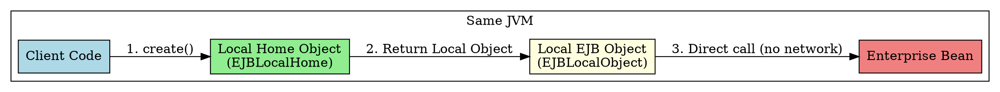

	
# Local Home Interface

## The Problem
The regular Home Interface uses RMI-IIOP for network communication—even when the client and bean are in the same JVM. This adds unnecessary overhead (serialization, network stack) for local calls.

## Core Idea
The Local Home Interface (`javax.ejb.EJBLocalHome`) is the high-performance version of the Home Interface. It's used when the client and bean are in the same JVM—no network calls, no `RemoteException`, direct memory access.

## How It Works
1. **Extends `EJBLocalHome`**: Unlike regular Home which extends `EJBHome` (which extends `java.rmi.Remote`)
2. **No `RemoteException`**: Since there's no network call, there's no possibility of network failure
3. **Returns Local Interface**: `create()` returns `HelloLocal` (local interface), not remote
4. **Fast**: Uses pass-by-reference semantics within the same JVM

## Visual Explanation



## Key Properties
- **No `RemoteException`**: Cleaner method signatures
- **Pass-by-reference**: Parameters passed directly (not serialized)
- **Faster**: No RMI-IIOP overhead
- **Same JVM requirement**: Cannot be used for remote clients

## Connections
- **Built from:** [[home-interface|Home Interface]] (remote version)
- **Builds into:** [[remote-interface|Remote Interface]] (contrast: remote has network overhead)
- **Related:** [[ejb-object|EJB Object]], [[session-bean|Session Bean]]
- **Contrasts with:** [[home-interface|Home Interface]] (remote, has `RemoteException`)

## Edge Cases & Gotchas
- **Mixing local and remote**: If you look up a LocalHome via JNDI from a remote client, you'll get an error
- **ClassLoader issues**: In same JVM but different ClassLoaders can still cause problems
- **Transaction propagation**: Local calls propagate transactions automatically (unlike remote which may require distributed transactions)

## Code Example
```java
public interface HelloLocalHome extends javax.ejb.EJBLocalHome {
    HelloLocal create() throws javax.ejb.CreateException;
    // Note: No RemoteException!
}
```

## Sources
- [[ejb5-summary|EJB5 Source Summary]]
