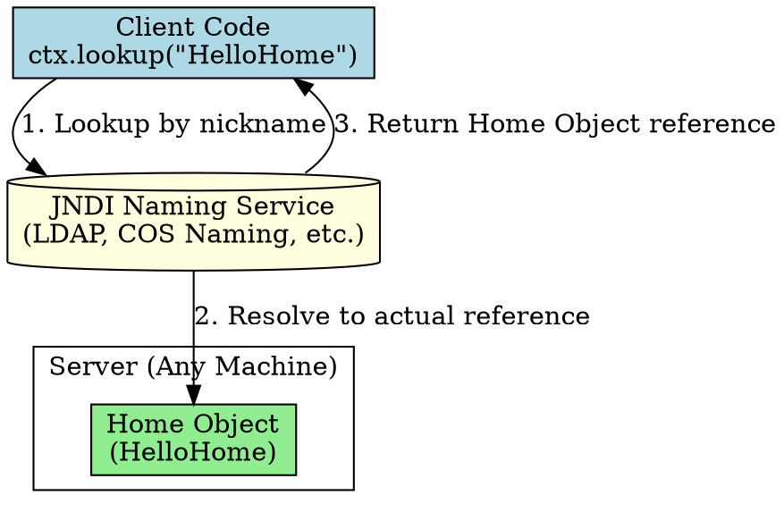

## The Problem
In distributed systems, clients need to know where a service lives (machine name, IP address, port). If the service moves to a different server, you must rewrite and recompile all client code. This creates tight coupling between clients and server locations.

## Core Idea
EJB achieves location transparency through JNDI (Java Naming and Directory Interface). Clients look up beans by a logical name (nickname) like `"HelloHome"`, not by physical address. The JNDI naming service maps this nickname to the actual Home Object reference—change the server, update JNDI, client code stays the same.

## How It Works
1. **Deployer binds nickname**: During deployment, container registers Home Object with JNDI using a nickname (e.g., `"HelloHome"`)
2. **Client looks up by nickname**: `ctx.lookup("HelloHome")` — no machine names in client code
3. **JNDI resolves location**: JNDI service (LDAP, COS Naming, or in-process) finds the actual object reference
4. **Server moves?**: Just update JNDI — client code unchanged

## Visual Explanation

## Key Properties
- **"Write Once, Run Anywhere"**: Client code portable across different server deployments
- **Naming services**: JNDI supports LDAP, CORBA Naming, in-process JNDI trees
- **Vendor-independent**: The lookup code is standard JNDI—works on any EJB container
- **Purchased components**: If you buy pre-written beans (no source), location transparency is essential—you can't rewrite them

## Connections
- **Built from:** [[jndi|JNDI]], [[home-interface|Home Interface]] (what gets looked up)
- **Builds into:** [[distributed-objects|Distributed Objects]] (clients can access beans anywhere)
- **Related:** [[middleware|Middleware]] (JNDI is a middleware service)
- **Contrasts with:** Hard-coded addresses (client breaks if server moves)

## Edge Cases & Gotchas
- **JNDI properties still machine-specific**: `Context.PROVIDER_URL` specifies naming service location—but this is configuration, not code
- **Network partition**: If JNDI service is unreachable, lookup fails (even if bean is running)
- **Nickname collisions**: Two beans with same JNDI name cause deployment errors

## Sources
- [[ejb5-summary|EJB5 Source Summary]]
