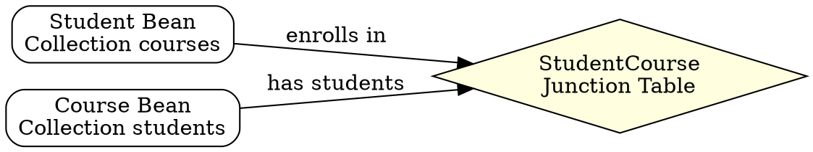

# Many-to-Many Relationship in EJB

## The Problem
Some relationships are truly many-to-many: a Student enrolls in many Courses, and a Course has many Students. The database needs a junction table, and EJB entity beans need Collections on both sides. Without CMR, this requires complex manual coding with junction table SQL.

## Core Idea
A many-to-many relationship means each entity instance can relate to multiple instances of another entity, and vice versa (e.g., Student ↔ Courses). In CMP, both sides declare `Collection` CMR fields with `<multiplicity>Many</multiplicity>`. In BMP, it's modeled as two one-to-many relationships via a junction table.

## How It Works

### Database Representation (Junction Table)
- `Student` table: `[StudentPK, Name]`
- `Course` table: `[CoursePK, Name]`
- `StudentCourse` junction table: `[StudentFK, CourseFK]` (composite primary key)

### BMP Implementation ("True M:N")
```java
// StudentBean
private Vector courses; // EJB object stubs
ejbLoad() {
    // 1. SQL SELECT Student
    // 2. JNDI lookup CourseHome
    // 3. Call CourseHome.findByStudent(studentPK) → returns Collection
}

// CourseBean
private Vector students; // EJB object stubs
ejbLoad() {
    // 1. SQL SELECT Course
    // 2. JNDI lookup StudentHome
    // 3. Call StudentHome.findByCourse(coursePK) → returns Collection
}
```

### CMP Implementation (Simpler)
```java
// StudentBean
public abstract Collection getCourses(); // no fields, no ejbLoad code

// CourseBean
public abstract Collection getStudents(); // no fields, no ejbLoad code
```
Deployment descriptor: both sides have `<multiplicity>Many</multiplicity>` and corresponding `<cmr-field>`.

## Visual Explanation


## Key Properties
- Requires junction table in database (for BMP, must manually query it)
- CMP: extremely straightforward — just use `Many` multiplicity on both sides
- BMP: modeled as two 1:N relationships, each bean does JNDI lookup of the other
- Both sides hold `Collection` of the other bean's stubs
- CMP ejbLoad() and ejbStore() remain empty — container handles junction table

## Connections
- Built from: [[one-to-many-relationship|One-to-Many Relationship]] — M:N is two 1:N relationships
- Built from: [[container-managed-persistence|CMP]] — CMR makes M:N trivial
- Built from: [[bean-managed-persistence|BMP]] — requires manual junction table handling
- Related: [[cmp-vs-bmp-relationships|CMP vs BMP Relationships]] — comparison of implementations
- Related: [[ejb-ql|EJB-QL]] — CMP uses EJB-QL queries for relationship navigation

## Edge Cases & Gotchas
- BMP "true M:N" implementation is really two 1:N with junction table queries
- Junction table must be manually managed in BMP (SQL INSERT/DELETE for associations)
- CMP container generates junction table SQL — you never see it
- Adding/removing from Collection in CMP may trigger multiple SQL operations (performance consideration)

## Sources
- [[EJb4-summary|EJb4.md Source Summary]]
