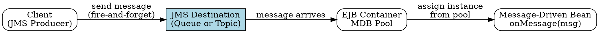

# Message-Driven Bean (MDB)

## The Problem
RMI-IIOP requires tight coupling between client and server — the client must wait (block) for a response, both must be online simultaneously, and it only supports 1-to-1 communication. Enterprise systems need asynchronous, loosely coupled, many-to-many messaging where the client doesn't wait and the server can be offline.

## Core Idea
A Message-Driven Bean is a special EJB component that receives messages (JMS or other types) from a destination and processes them asynchronously. It has no client-visible interfaces (no Home, Remote, or Local interfaces) — clients communicate only via messages sent to a destination.

## How It Works
1. MDB implements a message listener interface (e.g., `javax.jms.MessageListener` for JMS)
2. The container invokes `onMessage(Message msg)` when a message arrives at the destination
3. MDB has no identity (stateless) — container pools instances and assigns any available instance to handle a message
4. `onMessage()` is weakly typed — receives generic `Message` type, must use `instanceof` to determine actual message type
5. No return value to client — interaction is fire-and-forget (asynchronous)
6. Exceptions cannot be sent back to client — only system exceptions handled by container
7. From EJB 2.1+, MDBs can consume non-JMS messages via J2EE Connector Architecture (JCA) resource adapters

## Visual Explanation

## Key Properties
- Stateless — no conversational state, like stateless session beans
- No interfaces (Home, Remote, Local) — only message listener interface
- Implements `javax.jms.MessageListener` (for JMS) or other listener interfaces
- `onMessage()` is the only business method — handles all incoming messages
- Supports concurrent processing — container can assign multiple messages to multiple MDB instances
- Loosely coupled — client and MDB don't need to be online simultaneously

## Connections
- Built from: [[jms|JMS]] — MDBs typically consume JMS messages
- Built from: [[ejb-container|EJB Container]] — container manages MDB lifecycle and pooling
- Contrasts with: [[session-bean|Session Bean]] — session beans have interfaces and synchronous calls; MDB has no interfaces and async messages
- Contrasts with: [[entity-bean|Entity Bean]] — entity beans represent data; MDBs process messages
- Related: [[stateless-session-bean|Stateless Session Bean]] — both are stateless and pooled
- Related: [[poison-message|Poison Message]] — MDB rollback behavior can cause poison messages

## Edge Cases & Gotchas
- `onMessage()` cannot return values to clients (asynchronous fire-and-forget)
- Application exceptions cannot be propagated to clients — only system exceptions go to container
- Weak typing means you must check message type with `instanceof` at runtime
- MDBs cannot be called directly via RMI — only through message destinations
- From EJB 2.1+, can consume non-JMS messages via JCA resource adapters

## Sources
- [[EJb4-summary|EJb4.md Source Summary]]
