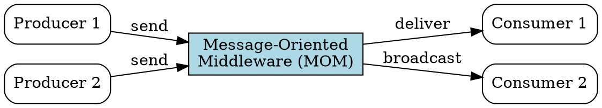

## The Problem
RMI-IIOP requires both client and server to be online simultaneously, and the client blocks while waiting for a response. There's no built-in support for many-to-many communication, and no guaranteed delivery if the server is down. Enterprise systems need asynchronous, decoupled, reliable messaging.

## Core Idea
MOM is infrastructure software that sits between message producers and consumers, enabling asynchronous, reliable, many-to-many messaging. It buffers messages, provides guaranteed delivery, and decouples producers from consumers.

## How It Works
1. Producer sends a message to the MOM middleman (not directly to consumer)
2. MOM stores the message (persistently if guaranteed delivery is needed)
3. Consumer retrieves messages from MOM when ready (or MOM pushes to consumer)
4. If consumer is offline, MOM holds messages until consumer comes back online
5. MOM products (IBM MQ, ActiveMQ, RabbitMQ) provide value-added services: load balancing, fault tolerance, subscriber throttling
6. JMS is the standard Java API that abstracts over different MOM implementations

## Visual Explanation

## Key Properties
- Provides asynchronous (fire-and-forget) communication
- Guarantees delivery even if consumer is temporarily offline
- Supports many-to-many communication (multiple producers → MOM → multiple consumers)
- Value-added services: guaranteed delivery, fault tolerance, load balancing
- Proprietary APIs led to vendor lock-in until JMS standardized the API

## Connections
- Builds into: [[jms|JMS]] — JMS is the standard API that abstracts MOM products
- Builds into: [[message-driven-bean|MDB]] — MDBs consume messages delivered by MOM
- Contrasts with: [[rmi-remote-method-invocation|RMI-IIOP]] — RMI is synchronous, 1:1, tightly coupled; MOM is async, many:many, loosely coupled
- Related: [[middleware|Middleware]] — MOM is a specific type of middleware
- Related: [[queue-partitioning|Queue Partitioning]] — MOM supports multiple queues for traffic separation

## Edge Cases & Gotchas
- MOM adds overhead (performance can be slower than direct RMI calls)
- Not all MOM products support the same features — JMS abstracts common features only
- Guaranteed delivery requires message persistence (disk I/O cost)
- "Fire-and-forget" means client has no idea if message processing succeeded

## Sources
- [[EJb4-summary|EJb4.md Source Summary]]
