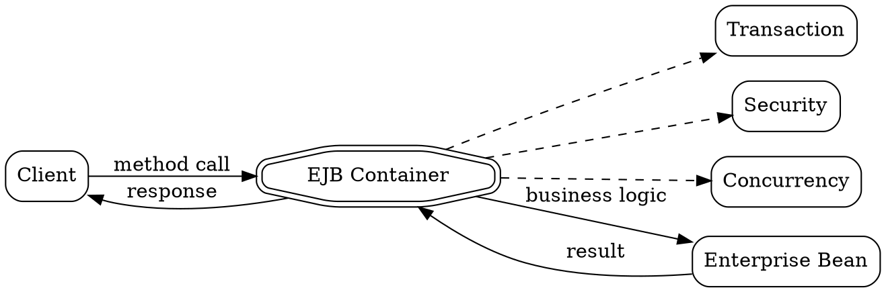

## The Problem
Building distributed systems is complex. Every operation needs transactions, security, concurrency handling, error recovery, and more. Writing this infrastructure code for every application is repetitive and error-prone. How can we separate business logic from system-level complexity?

## Core Idea
Middleware is software that sits between the client and server, handling all the infrastructure concerns automatically. It provides services like transactions, security, and communication transparently, so developers focus only on business logic. EJB is a middleware system in Java EE.

## How It Works
Without middleware: Client handles retry, security, transactions, error handling, networking
With EJB middleware: Client only calls method, container handles rest

Flow:
1. Client calls: bean.transferMoney(a, b, 1000)
2. Container intercepts the call
3. Container handles:
   - Transaction start/commit/rollback
   - Security check (is user authorized?)
   - Concurrency (thread-safe access)
   - Lifecycle (create/destroy bean)
   - Communication (RMI)
4. Bean executes business logic only
5. Results return through container

## Visual Explanation

## Key Properties
- Implicit middleware: EJB handles infrastructure automatically (declarative)
- Explicit middleware: Developer writes infrastructure code manually
- Declarative: Use annotations/XML to specify behavior
- Programmatic: Manual control when needed
- Container-managed: Services provided by EJB container
- ACID: Transactions are guaranteed

## Connections
- Built from: [[rmi-remote-method-invocation|RMI Remote Method Invocation]] — uses RMI for communication
- Builds into: [[ejb-container|EJB Container]] — EJB is the middleware implementation
- Built from: [[transaction-management|Transaction Management]] — middleware provides transactions
- Built from: [[ejb-security|EJB Security]] — middleware provides security

## Edge Cases & Gotchas
- Performance overhead: Middleware adds some latency
- Complexity: Can be hard to debug when things go wrong
- Vendor differences: Different servers may implement differently
- Trade-off: Control vs convenience
- Not always needed: Simple apps may not need full middleware