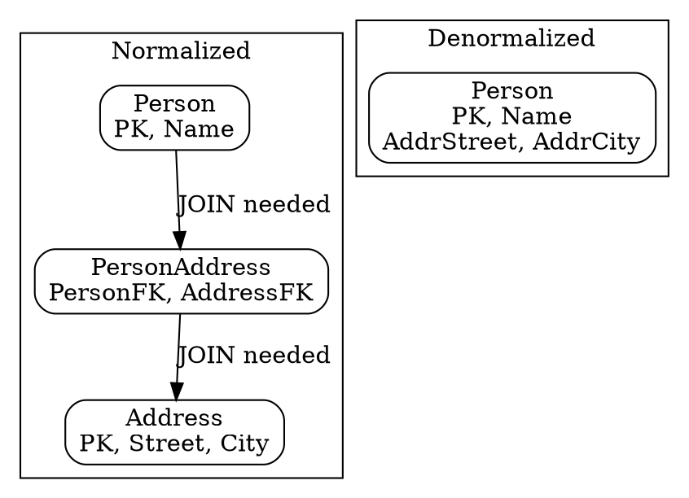

# Normalized vs Denormalized Database Schema

## The Problem
When mapping EJB entity bean relationships to database schemas, you can choose between normalized (less redundancy) and denormalized (faster queries) approaches. This is the classic computer science space-time tradeoff — more space used but faster time, or less space but slower time.

## Core Idea
**Normalized Schema:** Data redundancy minimized (separate tables, foreign keys). Requires JOIN queries for relationship navigation → slower but less storage, better data integrity. **Denormalized Schema:** Data duplicated across tables. Faster queries (no JOINs) but more storage, harder maintenance.

## How It Works

### Normalized Schema (Figure 15.6 — Person:Address example)
- `Person` table: `[PersonPK, Name, ...]`
- `Address` table: `[AddressPK, Street, City, ...]`
- `PersonAddress` table: `[PersonFK, AddressFK]` (junction for M:N)
- Requires JOINs to navigate relationships
- Less storage, better integrity, but slower queries

### Denormalized Schema (Figure 15.7)
- `Person` table: `[PersonPK, Name, AddressStreet, AddressCity, ...]`
- Address data duplicated inside Person table
- No JOINs needed for navigation → faster queries
- More storage, data redundancy, harder to maintain

### EJB Mapping
- EJB directionality (bidirectional/unidirectional) can be mapped to either schema
- Container can handle both — you just configure the O/R mapping
- CMP container generates SQL based on the schema you have

## Visual Explanation

## Key Properties
- **Normalized:** Less space, better integrity, slower queries (JOINs)
- **Denormalized:** More space, data redundancy, faster queries (no JOINs)
- EJB entity beans can map to either schema (container abstracts the difference)
- Directionality in beans doesn't have to match database schema directionality
- Classic space-time tradeoff in computer science

## Connections
- Built from: [[one-to-one-relationship|One-to-One Relationship]] — schema examples based on Person:Address
- Related: [[one-to-many-relationship|One-to-Many Relationship]] — normalized schema uses FK on "many" side
- Related: [[many-to-many-relationship|Many-to-Many Relationship]] — normalized needs junction table
- Related: [[container-managed-persistence|CMP]] — container handles O/R mapping for both schemas
- Related: [[bidirectional-vs-unidirectional|Bidirectional vs Unidirectional]] — bean directionality independent of DB schema

## Edge Cases & Gotchas
- EJB directionality (bidirectional) can be implemented on either schema type — don't assume DB schema matches object model
- Denormalized schemas risk data inconsistency (if duplicated data is updated in one place but not another)
- Normalized schemas with many JOINs can be slow for complex relationship navigation
- CMP container generates different SQL based on which schema you use

## Sources
- [[EJb4-summary|EJb4.md Source Summary]]
