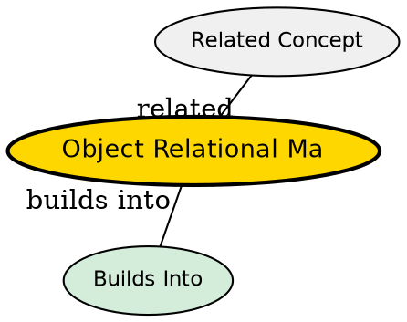

## The Problem

How do you convert Java objects to relational database tables and vice versa without writing complex SQL for every operation?

## Core Idea

Object-Relational Mapping (O/R mapping) is the technology of converting in-memory Java objects to relational database data (and back). It decomposes objects into database fields and maps object instances to table rows.

## How It Works

- Java class maps to a database table
- Class fields map to table columns
- Object instance maps to a table row
- O/R mapper generates SQL (INSERT, UPDATE, DELETE, SELECT) automatically
- Can query database using object-oriented queries instead of raw SQL

## Key Properties

- Decomposes objects into relational data
- Enables arbitrary database queries (unlike serialization)
- Data is visually inspectable in the database
- Can be handcrafted or automated with tools like Hibernate, EclipseLink, and MyBatis
- EJB uses this for entity beans (CMP)
- Hibernate extends ORM with caching (1st/2nd level), HQL (object-oriented queries), and inheritance mapping strategies

## Visual Explanation

## Semantic Network

## Connections

- Built from: [[entity-bean|Entity Bean]]
- Related: [[container-managed-persistence|Container-Managed Persistence]], [[jdbc|JDBC]]

## Edge Cases & Gotchas

- Complex object relationships (inheritance, nested objects) are challenging
- Performance can vary based on mapping strategy
- Tool-specific quirks and limitations