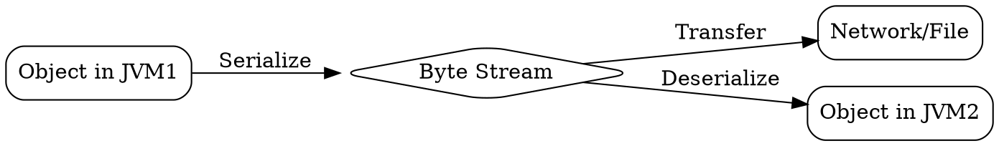

## The Problem
Objects in Java live in RAM with memory addresses. These addresses only make sense within the same JVM. When we need to send an object over a network (for RMI calls) or store it in a file, we cannot send raw memory — we need a machine-independent representation.

## Core Idea
Object Serialization is the process of converting a Java object into a byte stream so it can be transmitted over a network or stored in a file, then reconstructed later. The reverse process (deserialization) reconstructs the object from the byte stream.

## How It Works
1. Class implements Serializable interface
2. During serialization:
   - JVM captures class metadata (class name, serialVersionUID)
   - Recursively serializes all non-static, non-transient instance fields
   - Handles object graphs and circular references
   - Outputs structured byte stream
3. During deserialization:
   - JVM reads byte stream
   - Allocates new memory for object
   - Sets field values from stream
   - Does NOT call constructor
4. For RMI: serialized objects are sent as parameters/returns

## Visual Explanation

## Key Properties
- Portable: Platform-independent byte representation
- Recursive: Serializes entire object graph
- Reference tracking: Handles circular references to avoid infinite loops
- Identity not preserved: Deserialized objects are new instances, different from original
- State transfer only: Object data transfers, not memory identity
- serialVersionUID: Version tracking for compatibility

## Connections
- Built from: [[java-se|Java Standard Edition]] — Java feature
- Builds into: [[rmi-remote-method-invocation|RMI Remote Method Invocation]] — RMI depends on serialization
- Builds into: [[ejb-object|EJB Object]] — EJB uses serialization
- Related: [[transient-keyword|Transient Keyword]] — marks fields to exclude
- Contrasts with: [[json-serialization|JSON Serialization]] — text-based alternative

## Edge Cases & Gotchas
- static and transient fields are NOT serialized
- Non-serializable fields cause NotSerializableException
- Constructor is NOT called during deserialization — may skip important initialization
- Identity is lost: original != deserialized (different memory addresses)
- Security risk: Deserialization can execute malicious code
- Performance cost: Slow and CPU/memory intensive