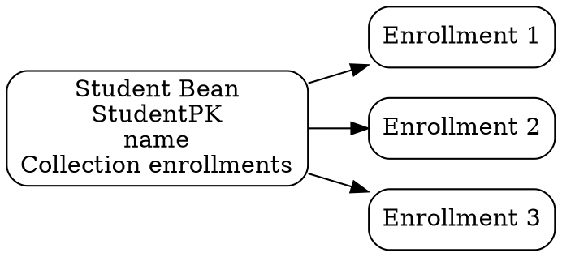

## The Problem
Many real-world relationships are one-to-many: a Student has many Enrollments, a Department has many Employees. EJB entity beans need to represent these using collections, but the database uses foreign keys on the "many" side, requiring navigation from both directions.

## Core Idea
A one-to-many relationship means one entity instance relates to multiple instances of another entity (e.g., Student → Many Courses). In CMP, this is modeled with `Collection` CMR fields and `<multiplicity>Many</multiplicity>` in the deployment descriptor.

## How It Works

### Database Representation
- "One" side: `Student` table `[StudentPK, Name]`
- "Many" side: `Enrollment` table `[EnrollmentPK, StudentFK, CoursePK]`
- Foreign key is on the "many" side table

### CMP Implementation
- On "One" side (Student): `public abstract Collection getEnrollments();`
- On "Many" side: `public abstract Student getStudent();`
- Deployment descriptor: set `<multiplicity>One</multiplicity>` on Student side, `<multiplicity>Many</multiplicity>` on Enrollment side
- Container manages the collection automatically

### BMP Implementation
- On "One" side: `private Vector enrollments;` + JNDI lookup of EnrollmentHome + `findByStudent(studentPK)` in `ejbLoad()`
- On "Many" side: `private Student studentStub;` + JNDI lookup + `findByPrimaryKey(studentFK)` in `ejbLoad()`
- More code than CMP — manual collection management

## Visual Explanation

## Key Properties
- "One" side holds a Collection of "many" side stubs
- Many-to-one is the same as one-to-many, just viewed from the other direction
- CMP uses `java.util.Collection` as the CMR field type
- BMP requires manual JNDI lookups and collection population in `ejbLoad()`
- Can be bidirectional (both sides know each other) or unidirectional

## Connections
- Built from: [[entity-bean|Entity Bean]] — relationships between entity beans
- Built from: [[container-managed-persistence|CMP]] — uses CMR fields
- Related: [[many-to-many-relationship|Many-to-Many Relationship]] — two 1:N make an M:N
- Related: [[one-to-one-relationship|One-to-One Relationship]] — simpler cardinality
- Related: [[bidirectional-vs-unidirectional|Bidirectional vs Unidirectional]] — directionality applies to 1:N
- Contrasts with: [[session-bean-relationships|Session Bean Relationships]] — session beans can do relationships but with manual JDBC code

## Edge Cases & Gotchas
- Forgetting to initialize the Collection in BMP ejbLoad() causes NullPointerException
- CMP Collection is managed by container — don't try to instantiate it yourself
- Lazy loading: container may not populate Collection until you access it (performance implication)
- Removing from Collection in CMP: must also handle the database foreign key update

## Sources
- [[EJb4-summary|EJb4.md Source Summary]]
