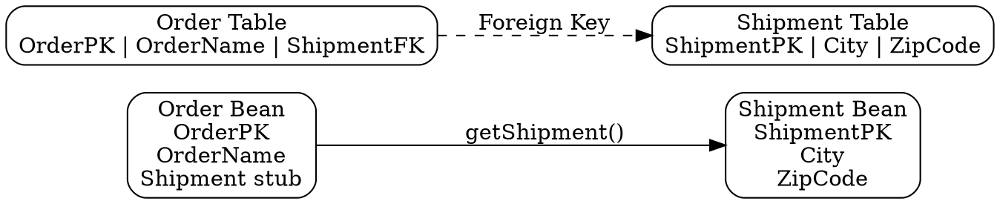

## The Problem
In database design, some entities have a one-to-one relationship (e.g., Order has one Shipment, Person has one Address). EJB entity beans need to navigate and persist these relationships, but Java objects use references while databases use foreign keys.

## Core Idea
A one-to-one relationship means each entity instance is related to at most one instance of another entity. In EJB, this is implemented via CMR (Container-Managed Relationships) in CMP, or via foreign key lookups in BMP using JNDI and Home interfaces.

## How It Works

### Database Level (Figure 15.2)
- `Order` table has columns: `[OrderPK, OrderName, ShipmentPK (FK)]`
- `Shipment` table has columns: `[ShipmentPK, City, ZipCode]`
- Foreign key in Order table points to Shipment primary key

### BMP Implementation
1. `ejbLoad()`: After loading order data (including FK), do JNDI lookup of `ShipmentHome`, call `findByPrimaryKey(shipmentFK)` → get Shipment stub
2. `ejbStore()`: Call `shipment.getPrimaryKey()` to get FK, then SQL UPDATE with FK value
3. Store stub in bean field: `private Shipment shipment;`

### CMP Implementation
- Define abstract getter/setter: `public abstract Shipment getShipment();`
- Container manages relationship via `<cmr-field>` in `ejb-jar.xml`
- `ejbLoad()` and `ejbStore()` are empty — container handles everything

## Visual Explanation

## Key Properties
- Each Order has at most one Shipment (1:1 cardinality)
- In BMP: foreign key ↔ object stub conversion in ejbLoad/ejbStore
- In CMP: container manages the relationship automatically via CMR
- Database schema can have FK in either direction (Order→Shipment or Shipment→Order)
- `getPrimaryKey()` is critical in BMP to convert stub back to FK for SQL

## Connections
- Built from: [[entity-bean|Entity Bean]] — relationships exist between entity beans
- Built from: [[container-managed-persistence|CMP]] — uses CMR fields for relationships
- Built from: [[bean-managed-persistence|BMP]] — manual JNDI lookup for relationships
- Related: [[one-to-many-relationship|One-to-Many Relationship]] — next cardinality level
- Related: [[bidirectional-vs-unidirectional|Bidirectional vs Unidirectional]] — directionality applies to 1:1
- Related: [[getprimarykey|getPrimaryKey()]] — used in BMP to get FK from stub

## Edge Cases & Gotchas
- Persisting a stub directly would create a bit-blob in the FK column (BMP)
- BMP requires JNDI lookup + findByPrimaryKey in ejbLoad (extra code/overhead)
- CMP relationships are defined in deployment descriptor, not Java code
- Wrong directionality (unidirectional when you need bidirectional) limits navigation