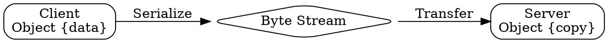

## The Problem
When a method is called in RMI, parameters cross JVM boundaries. But the JVMs have completely separate memory spaces — they cannot share references. How does RMI handle sending regular objects as parameters?

## Core Idea
In RMI, normal objects (non-Remote) are passed by value. The object is serialized, sent over the network, and reconstructed on the server as a completely separate copy. Changes to the copy do NOT affect the original.

## How It Works
1. Client calls: remoteObj.method(myObject)
2. RMI serializes myObject into a byte stream
3. Byte stream is sent over network
4. Server reconstructs myObject from byte stream (new memory allocation)
5. Server uses the copy for method execution
6. If server modifies the copy, original is unchanged
7. Return value is similarly serialized and sent back

## Visual Explanation

## Key Properties
- Deep copy: Object is fully copied including all fields
- Independence: Original and copy are completely separate
- No state sharing: Modifications don't propagate
- State transfer: Only data is transferred, not identity
- Default for non-Remote objects: Most parameters use this

## Connections
- Built from: [[object-serialization|Object Serialization]] — mechanism for passing by value
- Contrasts with: [[pass-by-reference-in-rmi|Pass-by-Reference in RMI]] — Remote objects use different mechanism
- Built from: [[rmi-remote-method-invocation|RMI Remote Method Invocation]] — call context

## Edge Cases & Gotchas
- If object contains non-serializable fields, serialization fails
- Circular references are handled correctly by Java
- Constructor is NOT called during reconstruction
- Performance: Large objects are expensive to serialize
- This is different from Java's "pass reference by value" for local calls