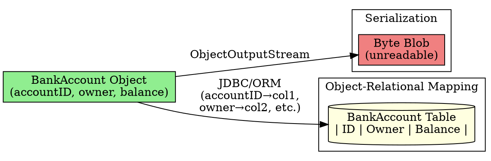

## The Problem
Objects live in RAM—when the program stops, they're gone. To keep data permanently (across restarts, for other applications to use), objects must be saved to persistent storage (database, filesystem). What are the ways to persist Java objects?

## Core Idea
There are two main ways to persist Java objects:
1. **Serialization**: Convert the entire object to a byte stream (blob) and save it. Simple but not queryable.
2. **Object-Relational Mapping (ORM)**: Decompose the object into fields and store them as rows/columns in a relational database. Queryable and debuggable.

Entity Beans use ORM (not serialization) for persistence.

## How It Works

| Mechanism | How | Pros | Cons |
|-----------|------|------|------|
| **Serialization** | `ObjectOutputStream` → byte blob | Simple, built-in | Not queryable, hard to debug |
| **ORM** | Map fields → table columns | Queryable, standard SQL | More complex setup |
| **Object DB** | Store as native object | No mapping needed | Not widely adopted |

## Visual Explanation

## Key Properties
- **Entity Beans use ORM**: They map to relational database tables (not serialization)
- **EJB doesn't dictate ORM tool**: You can use JDBC (BMP) or container-managed (CMP)
- **Modern tools**: Hibernate, TopLink, JDO—automate ORM (popular in EJB 3.x+)
- **Queryable**: Unlike serialization, ORM lets you run SQL queries like "find all accounts with balance > $1000"

## Connections
- **Built from:** [[object-relational-mapping|Object-Relational Mapping]], [[entity-bean|Entity Bean]]
- **Builds into:** [[bean-managed-persistence|Bean-Managed Persistence]] (JDBC), [[container-managed-persistence|Container-Managed Persistence]] (auto)
- **Related:** [[jdbc|JDBC]] (API for ORM implementation)
- **Contrasts with:** Session beans (non-persistent, RAM-only)

## Edge Cases & Gotchas
- **Serialization is easier but limiting**: Good for simple caching, bad for business data
- **ORM has a learning curve**: Mapping complex object relationships to tables requires skill
- **JDO (Java Data Objects)**: Alternative to EJB entity beans for persistence (portable across databases)