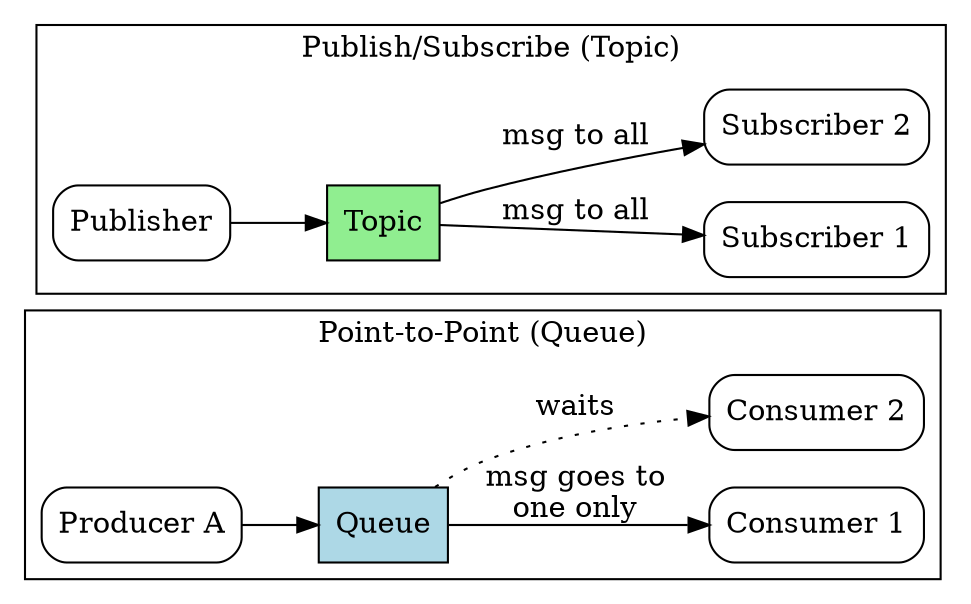

## The Problem
Messaging systems need to support different communication patterns: sometimes you want one-to-one delivery (like a personal SMS), and sometimes one-to-many broadcast (like a radio station). Without distinct models, the messaging API would be ambiguous about delivery semantics.

## Core Idea
JMS defines two messaging domains: **Point-to-Point (PTP)** uses Queues for one-to-one delivery (each message consumed by exactly one receiver), while **Publish/Subscribe (Pub/Sub)** uses Topics for one-to-many broadcast (each message delivered to all subscribers).

## How It Works

### Point-to-Point (Queue)
1. Producer sends message to a Queue destination
2. Message stays in queue until a Consumer receives it
3. Each message is consumed by exactly **one** consumer (even if multiple consumers are listening)
4. If no consumers are available, message remains in queue until one connects

### Publish/Subscribe (Topic)
1. Publisher sends message to a Topic destination
2. All active Subscribers registered to that topic receive the message
3. Each subscriber gets its own copy of the message
4. Durable subscribers can receive messages even if they were offline (messages persisted)

### JMS Interface Mapping
| Interface | PTP (Queue) | Pub/Sub (Topic) |
|---|---|---|
| ConnectionFactory | `QueueConnectionFactory` | `TopicConnectionFactory` |
| Connection | `QueueConnection` | `TopicConnection` |
| Session | `QueueSession` | `TopicSession` |
| Destination | `Queue` | `Topic` |
| Producer | `QueueSender` | `TopicPublisher` |
| Consumer | `QueueReceiver` | `TopicSubscriber` |

## Visual Explanation

## Key Properties
- **PTP:** Guarantees exactly-once delivery to a single consumer; good for load balancing work across consumers
- **Pub/Sub:** Broadcasts to all subscribers; good for event notification, news feeds
- PTP Queue messages persist until consumed; Pub/Sub Topic messages only go to active subscribers (unless durable)
- Same JMS code structure, different interface types for each domain
- EJB MDBs can listen to either Queues or Topics

## Connections
- Built from: [[jms|JMS]] — these are the two JMS messaging domains
- Built from: [[jms-programming-model|JMS Programming Model]] — the model applies to both PTP and Pub/Sub
- Builds into: [[message-driven-bean|MDB]] — MDBs consume from either Queues or Topics
- Related: [[queue-partitioning|Queue Partitioning]] — using multiple queues for traffic separation
- Contrasts with: [[rmi-remote-method-invocation|RMI-IIOP]] — RMI is always 1:1, messaging offers both 1:1 and 1:N

## Edge Cases & Gotchas
- Pub/Sub with no active subscribers means messages are lost (unless durable subscriptions)
- PTP with multiple consumers: you can't predict which consumer gets which message
- Mixing Queue and Topic interfaces (e.g., using `QueueSender` with a Topic) causes runtime errors
- Durable subscribers in Pub/Sub must be explicitly created and have a unique client ID